<h1 style="text-align: center;">&nbsp;uniapp中使用colorUI</h1>
<h2 style="text-align: left;">1.开始</h2>

　　下载源码解压获得<code>/Colorui-UniApp</code>文件夹，复制目录下的&nbsp;<code>/colorui</code>&nbsp;文件夹到你的项目根目录

<code>　　App.vue</code>&nbsp;引入关键Css&nbsp;<code>main.css</code>&nbsp;<code>icon.css</code>

<pre>&lt;style&gt;
    /* 引入colorui主体 */
    @import "colorui/main.css";
    /* 引入colorui图标类资源 */
    @import "colorui/icon.css";
&lt;/style&gt;</pre>

&nbsp;

<h2>2.使用自定义导航栏</h2>

<code>　　（1）App.vue</code>&nbsp;获得系统信息

<pre>onLaunch: function() {
    uni.getSystemInfo({
        success: function(e) {
            // #ifndef MP
            Vue.prototype.StatusBar = e.statusBarHeight;
            if (e.platform == 'android') {
                Vue.prototype.CustomBar = e.statusBarHeight + 50;
            } else {
                Vue.prototype.CustomBar = e.statusBarHeight + 45;
            };
            // #endif
            // #ifdef MP-WEIXIN
            Vue.prototype.StatusBar = e.statusBarHeight;
            let custom = wx.getMenuButtonBoundingClientRect();
            Vue.prototype.Custom = custom;
            Vue.prototype.CustomBar = custom.bottom + custom.top - e.statusBarHeight;
            // #endif        
            // #ifdef MP-ALIPAY
            Vue.prototype.StatusBar = e.statusBarHeight;
            Vue.prototype.CustomBar = e.statusBarHeight + e.titleBarHeight;
            // #endif
        }
    })
},</pre>

<code>　　（2）pages.json</code>&nbsp;配置取消系统导航栏

<pre>"globalStyle": {
    "navigationStyle": "custom"
},</pre>

&nbsp;　　（3）使用封装,在<code>main.js</code>&nbsp;引入&nbsp;<code>cu-custom</code>&nbsp;组件。

<pre>import cuCustom from './colorui/components/cu-custom.vue'
Vue.component('cu-custom',cuCustom)</pre>

　　（4）就可以直接在页面中使用

<pre>&lt;cu-custom bgColor="bg-gradual-blue" :isBack="true"&gt;&lt;view slot="backText"&gt;返回&lt;/view&gt;&lt;view slot="content"&gt;图标&lt;/view&gt;&lt;/cu-custom&gt;</pre>

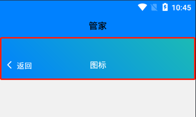

<h2>3.flex布局( "|"表示或，后面涉及同理 )</h2>

父级容器的class需要加入<strong>flex</strong>

　　（1）固定尺寸（ 在class中加入<strong>basis-xs|sm|sub|lg|xl</strong>&nbsp; &nbsp; ）

　　　　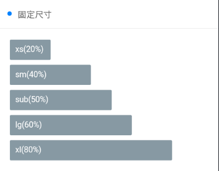

<pre>例如：
                &lt;view class="flex flex-wrap"&gt;
                    &lt;view class="basis-xs bg-grey margin-xs padding-sm radius"&gt;xs(20%)&lt;/view&gt;
                    &lt;view class="basis-df"&gt;&lt;/view&gt;
                    &lt;view class="basis-sm bg-grey margin-xs padding-sm radius"&gt;sm(40%)&lt;/view&gt;
                    &lt;view class="basis-df"&gt;&lt;/view&gt;
                    &lt;view class="basis-df bg-grey margin-xs padding-sm radius"&gt;sub(50%)&lt;/view&gt;
                    &lt;view class="basis-lg bg-grey margin-xs padding-sm radius"&gt;lg(60%)&lt;/view&gt;
                    &lt;view class="basis-xl bg-grey margin-xs padding-sm radius"&gt;xl(80%)&lt;/view&gt;
                &lt;/view&gt;</pre>

　　（2）比例布局（在class中加入<strong>flex-sub|twice|treble</strong>）

　　　　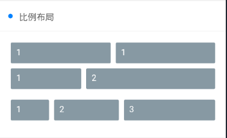

<pre>例如：
1:1
                &lt;view class="flex"&gt;
                    &lt;view class="flex-sub bg-grey padding-sm margin-xs radius"&gt;1&lt;/view&gt;
                    &lt;view class="flex-sub bg-grey padding-sm margin-xs radius"&gt;1&lt;/view&gt;
                &lt;/view&gt;
1:2
                &lt;view class="flex  p-xs margin-bottom-sm mb-sm"&gt;
                    &lt;view class="flex-sub bg-grey padding-sm margin-xs radius"&gt;1&lt;/view&gt;
                    &lt;view class="flex-twice bg-grey padding-sm margin-xs radius"&gt;2&lt;/view&gt;
                &lt;/view&gt;
1:2:3
                &lt;view class="flex  p-xs margin-bottom-sm mb-sm"&gt;
                    &lt;view class="flex-sub bg-grey padding-sm margin-xs radius"&gt;1&lt;/view&gt;
                    &lt;view class="flex-twice bg-grey padding-sm margin-xs radius"&gt;2&lt;/view&gt;
                    &lt;view class="flex-treble bg-grey padding-sm margin-xs radius"&gt;3&lt;/view&gt;
                &lt;/view&gt;</pre>

　　（3）水平对齐（父容器的class中加入<strong>justify-start|end|center|between|around</strong>）

　　　　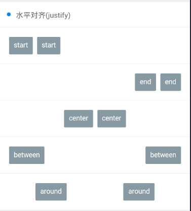

<pre>例如：
                &lt;view class="flex solid-bottom padding justify-start"&gt;
                    &lt;view class="bg-grey padding-sm margin-xs radius"&gt;start&lt;/view&gt;
                    &lt;view class="bg-grey padding-sm margin-xs radius"&gt;start&lt;/view&gt;
                &lt;/view&gt;
                &lt;view class="flex solid-bottom padding justify-end"&gt;
                    &lt;view class="bg-grey padding-sm margin-xs radius"&gt;end&lt;/view&gt;
                    &lt;view class="bg-grey padding-sm margin-xs radius"&gt;end&lt;/view&gt;
                &lt;/view&gt;
                &lt;view class="flex solid-bottom padding justify-center"&gt;
                    &lt;view class="bg-grey padding-sm margin-xs radius"&gt;center&lt;/view&gt;
                    &lt;view class="bg-grey padding-sm margin-xs radius"&gt;center&lt;/view&gt;
                &lt;/view&gt;
                &lt;view class="flex solid-bottom padding justify-between"&gt;
                    &lt;view class="bg-grey padding-sm margin-xs radius"&gt;between&lt;/view&gt;
                    &lt;view class="bg-grey padding-sm margin-xs radius"&gt;between&lt;/view&gt;
                &lt;/view&gt;
                &lt;view class="flex solid-bottom padding justify-around"&gt;
                    &lt;view class="bg-grey padding-sm margin-xs radius"&gt;around&lt;/view&gt;
                    &lt;view class="bg-grey padding-sm margin-xs radius"&gt;around&lt;/view&gt;
                &lt;/view&gt;</pre>

　　（4）垂直对齐（父容器的class中加入<strong>align-start|end|center</strong>）

　　　　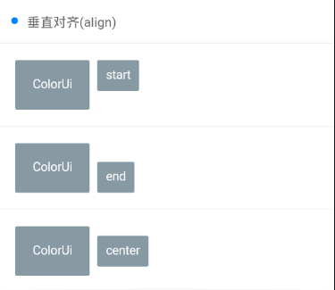

<pre>例如：
                &lt;view class="flex solid-bottom padding align-start"&gt;
                    &lt;view class="bg-grey padding-lg margin-xs radius"&gt;ColorUi&lt;/view&gt;
                    &lt;view class="bg-grey padding-sm margin-xs radius"&gt;start&lt;/view&gt;
                &lt;/view&gt;
                &lt;view class="flex solid-bottom padding align-end"&gt;
                    &lt;view class="bg-grey padding-lg margin-xs radius"&gt;ColorUi&lt;/view&gt;
                    &lt;view class="bg-grey padding-sm margin-xs radius"&gt;end&lt;/view&gt;
                &lt;/view&gt;
                &lt;view class="flex solid-bottom padding align-center"&gt;
                    &lt;view class="bg-grey padding-lg margin-xs radius"&gt;ColorUi&lt;/view&gt;
                    &lt;view class="bg-grey padding-sm margin-xs radius"&gt;center&lt;/view&gt;
                &lt;/view&gt;</pre>

&nbsp;

<h2>4.Grid布局</h2>

　　（1）等分列（class加入<strong>grid col-1|2|3|...</strong>）

　　　　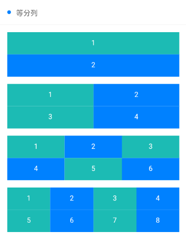

　　　　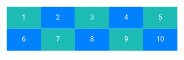

<pre>                &lt;view class="grid margin-bottom text-center" v-for="(item,index) in 5"
                 :key="index" :class="'col-' + (index+1)"&gt;
                    &lt;view class="padding" :class="indexs%2==0?'bg-cyan':'bg-blue'"
                     v-for="(item,indexs) in (index+1)*2" :key="indexs"&gt;
                     {{indexs+1}}
                    &lt;/view&gt;
                &lt;/view&gt;</pre>

　　自己试用：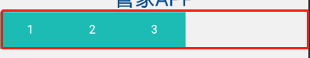

<pre>        &lt;view class="grid margin-bottom text-center col-5"&gt;
            &lt;view class="padding bg-cyan"&gt;{{1}}&lt;/view&gt;
            &lt;view class="padding bg-cyan"&gt;{{2}}&lt;/view&gt;
            &lt;view class="padding bg-cyan"&gt;{{3}}&lt;/view&gt;
        &lt;/view&gt;</pre>

　　（2）等高(在class中加入<strong>grid col-4|5|... grid-square</strong>)

　　　　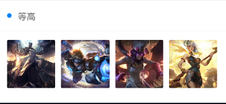

<pre>　　　　　　　　　　&lt;view class="grid col-4 grid-square"&gt;                     　　　　　　　　　　　　&lt;view class="bg-img" v-for="(item,index) in avatar"
                     :key="index"
                     :style="[{ backgroundImage:'url(' + avatar[index] + ')' }]"&gt;&lt;/view&gt; 　　　　　　　　　　&lt;/view&gt;

data(){return{
avatar:['https://ossweb-img.qq.com/images/lol/web201310/skin/big10001.jpg',
'https://ossweb-img.qq.com/images/lol/web201310/skin/big81005.jpg',
'https://ossweb-img.qq.com/images/lol/web201310/skin/big25002.jpg',
'https://ossweb-img.qq.com/images/lol/web201310/skin/big99008.jpg']
}}</pre>

<h2>&nbsp;5.辅助布局</h2>

　　（1）浮动（在class加入<strong>fl|fr</strong>,在父容器class加入<strong>cf</strong>）

　　　　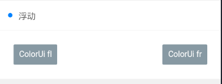

&nbsp;　　(2)内外边距

　　　　<strong>size=xs|sm|df|lg|xl</strong>

<table style="height: 458px; width: 448px;" border="0" cellspacing="3" cellpadding="3" align="left">
<tbody>
<tr>
<td>外边距</td>
<td>margin-{size}</td>
</tr>
<tr>
<td>内边距　</td>
<td>padding-{size}</td>
</tr>
<tr>
<td>水平方向外边距</td>
<td>margin-lr-{size}</td>
</tr>
<tr>
<td>水平方向内边距</td>
<td>padding-lr-{size}</td>
</tr>
<tr>
<td>垂直方向外边距</td>
<td>margin-tb-{size}</td>
</tr>
<tr>
<td>垂直方向内边距</td>
<td>padding-tb-{size}</td>
</tr>
<tr>
<td>上外边距</td>
<td>margin-top-{size}</td>
</tr>
<tr>
<td>上内边距</td>
<td>padding-top-{size}</td>
</tr>
<tr>
<td>右外边距</td>
<td>margin-right-{size}</td>
</tr>
<tr>
<td style="text-align: left;">右内边距</td>
<td>padding-right-{size}</td>
</tr>
<tr>
<td>下外边距</td>
<td>margin-bottom-{size}</td>
</tr>
<tr>
<td>下内边距</td>
<td>padding-bottom-{size}</td>
</tr>
<tr>
<td>左外边距</td>
<td>margin-left-{size}</td>
</tr>
<tr>
<td>左内边距</td>
<td>padding-left-{size}</td>
</tr>
</tbody>
</table>

<strong>&nbsp;</strong>

&nbsp;

&nbsp;

&nbsp;

&nbsp;

&nbsp;

&nbsp;

&nbsp;

&nbsp;

&nbsp;

&nbsp;

&nbsp;

&nbsp;

&nbsp;

&nbsp;

<h2 style="text-align: left;">&nbsp;</h2>
<h2 style="text-align: left;">&nbsp;</h2>
<h2 style="text-align: left;"><strong>6.图标（在class上添加 cuIcon-pepole|check|...）</strong></h2>

<strong>例如</strong>

<pre>&lt;text class="cuIcon-people"&gt;&lt;/text&gt;</pre>

<strong>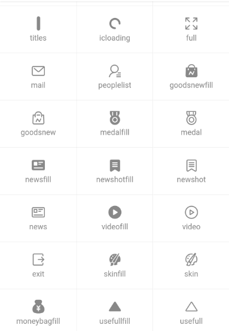</strong><strong>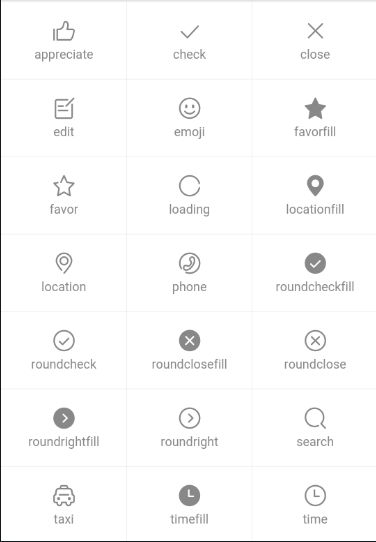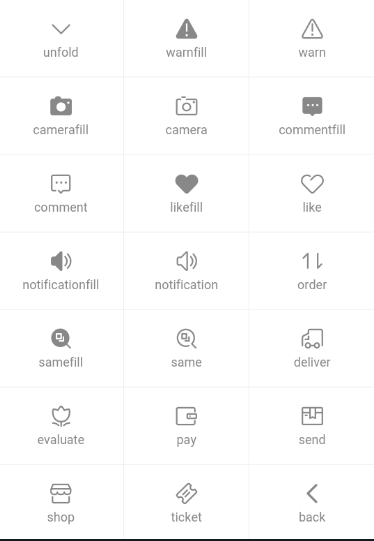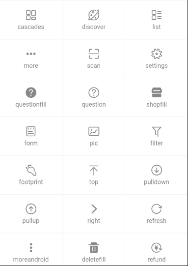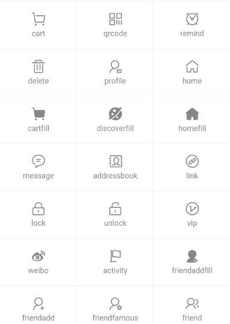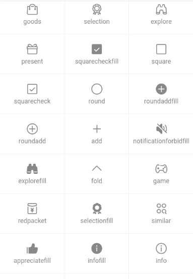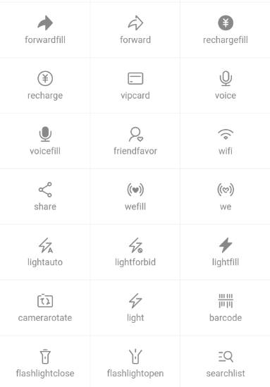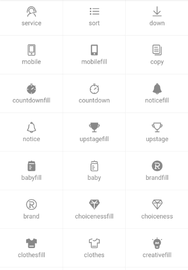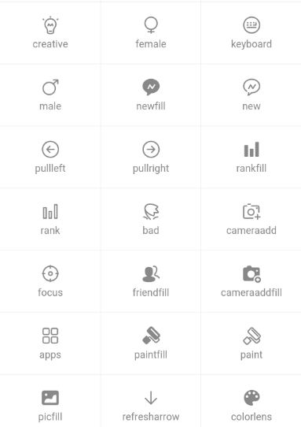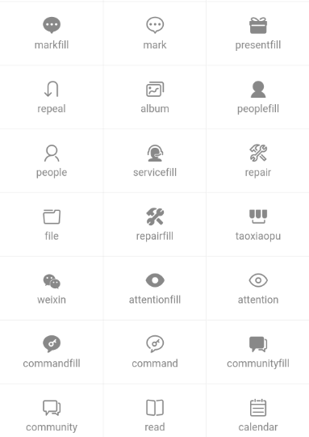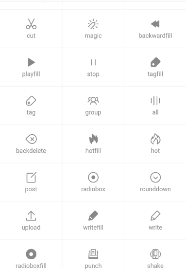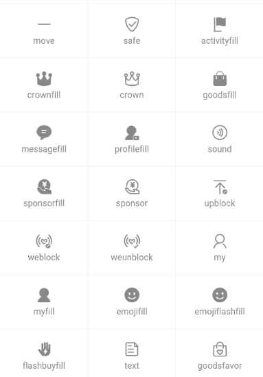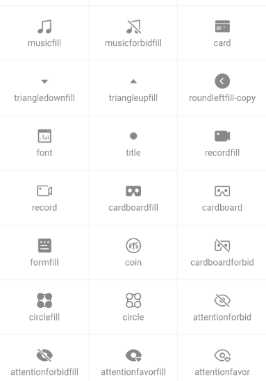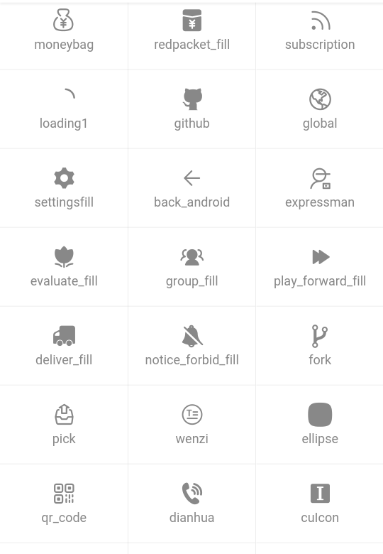</strong>

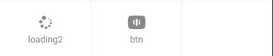

&nbsp;

<h2>&nbsp;7.背景</h2>

　　(1)当想要深色的背景的时候，

　　　　在class中加入<strong>&nbsp;bg-Red|Orange|...</strong>

<pre>　　&lt;view class="padding radius text-center shadow-blur" :class="'bg-' + name"&gt;&lt;/view&gt;<strong style="font-size: 16px; background-color: #ffffff; font-family: 'PingFang SC', 'Helvetica Neue', Helvetica, Arial, sans-serif;">&nbsp;</strong></pre>

　　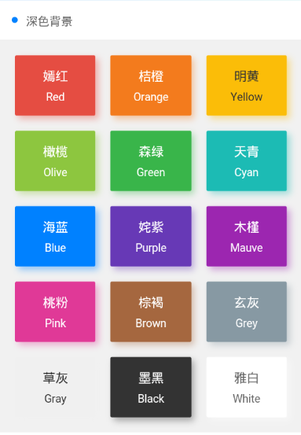

　　(2)当想要淡色的背景的时候，

　　　　在class中加入<strong>&nbsp;bg-Red|Orange|...，</strong>

　　　　在class中再加入 <strong>light</strong>

<pre>　　&lt;view class="padding radius text-center light" :class="'bg-' + name"&gt;&lt;/view&gt;</pre>

　　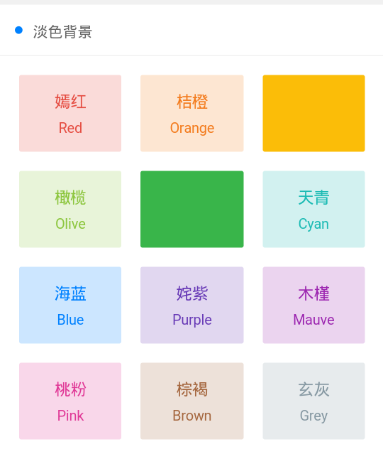

　　(3)当想要渐变的背景的时候，

　　　　在class中加入<strong>&nbsp;bg-gradual-red|orange|...，</strong>

<pre>                &lt;view class="bg-gradual-red padding radius text-center shadow-blur"&gt;
                    &lt;view class="text-lg"&gt;魅红&lt;/view&gt;
                    &lt;view class="margin-top-sm text-Abc"&gt;#f43f3b - #ec008c&lt;/view&gt;
                &lt;/view&gt;</pre>

　　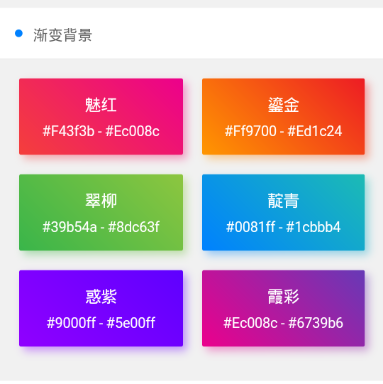

　　（4）当想要背景图片的时候，

　　　　在class中加入 <strong>bg-img bg-mask</strong>

<pre>        &lt;view class="bg-img bg-mask flex align-center"
         style="background-image: url('https://ossweb-img.qq.com/images/lol/web201310/skin/big10006.jpg');height: 414upx;"&gt;
            &lt;view class="padding-xl text-white"&gt;
                &lt;view class="padding-xs text-xxl text-bold"&gt;
                    钢铁之翼
                &lt;/view&gt;
                &lt;view class="padding-xs text-lg"&gt;
                    Only the guilty need fear me.
                &lt;/view&gt;
            &lt;/view&gt;
        &lt;/view&gt;</pre>

　　（5）当文字需要透明背景时

　　　　在class中加入<strong> bg-shadeBottom|shadeTop</strong>

<pre>            &lt;view class="bg-img padding-bottom-xl" style="background-image: url('https://ossweb-img.qq.com/images/lol/web201310/skin/big10007.jpg');height: 207upx;"&gt;
                &lt;view class="bg-shadeTop padding padding-bottom-xl"&gt;
                    上面开始
                &lt;/view&gt;
            &lt;/view&gt;
            &lt;view class="bg-img padding-top-xl flex align-end" style="background-image: url('https://ossweb-img.qq.com/images/lol/web201310/skin/big10001.jpg');height: 207upx;"&gt;
                &lt;view class="bg-shadeBottom padding padding-top-xl flex-sub"&gt;
                    下面开始
                &lt;/view&gt;
            &lt;/view&gt;</pre>

　　

&nbsp;

<h2>&nbsp;8.文字</h2>

&nbsp;　　（1）文字大小

　　　　.text-xsl　　文字大小 60px 用于图标、数字等特大显示

　　　　.text-sl　　&nbsp; 文字大小 40px 用于图标、数字等较大显示

　　　　.text-xxl　　文字大小 22px 用于金额数字等信息

　　　　.text-xl　　&nbsp; 文字大小 18px 页面大标题，用于结果页等单一信息页

　　　　.text-lg　　&nbsp; 文字大小 16px 页面小标题，首要层级显示内容

　　　　.text-df　　&nbsp; 文字大小 14px 页面默认字号，用于摘要或阅读文本

　　　　.text-sm　&nbsp; &nbsp; 文字大小 12px 页面辅助信息，次级内容等

　　　　.text-xs　　 文字大小 10px 说明文本，标签文字等关注度低的文字

　　（2）文字颜色（在class中加入 <strong>text-red|orange|...</strong>）颜色参考7.背景

　　（3）文字阴影（在class中加入&nbsp;<strong>text-shadow</strong>）

　　（4）文字截断 ...(在class中加入&nbsp;<strong>text-cut&nbsp; ,要给定容器宽度</strong>)

　　（5）文字对齐（在class中加入&nbsp;<strong>text-center|left|right</strong>)

　　（6）特殊文字

&nbsp;　　　　text-price　　价格￥

　　　　&nbsp;text-Abc　　&nbsp;英文单词首字母大写

　　　　&nbsp;text-abc　　 全部英文字母小写

　　　　&nbsp;text-ABC　&nbsp; &nbsp;全部英文字母大写

&nbsp;

<h2>&nbsp;9.按钮</h2>

　　（1）按钮形状

　　　　cu-btn（默认）　　　　cu-btn round（圆角）　　　　cu-btn cuIcon（图标按钮）

　　　　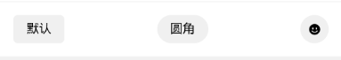

<pre>            &lt;button class="cu-btn"&gt;默认&lt;/button&gt;
            &lt;button class="cu-btn round"&gt;圆角&lt;/button&gt;
            &lt;button class="cu-btn cuIcon"&gt;
                &lt;text class="cuIcon-emojifill"&gt;&lt;/text&gt;
            &lt;/button&gt;</pre>

　　（2）按钮尺寸

　　　　cu-btn sm（小尺寸）　　　　cu-btn（默认）　　　　cu-btn lg（大尺寸）

　　（3）按钮颜色

　　　　bg-red|...

　　　　阴影&nbsp; &nbsp; &nbsp;&nbsp;shadow

　　（4）按钮镂空

　　　　lines-red|...　　(边框深）　　　　line-red|...　　（边框浅）

　　（5）按钮块状

　　　　cu-btn lg

　　（6）按钮无效

　　　　disabled

　　（7）按钮加图标

　　　　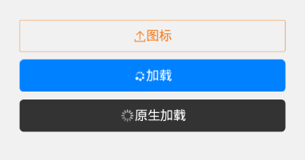

<pre>            &lt;button class="cu-btn block line-orange lg"&gt;
                &lt;text class="cuIcon-upload"&gt;&lt;/text&gt; 图标&lt;/button&gt;
            &lt;button class="cu-btn block bg-blue margin-tb-sm lg"&gt;
                &lt;text class="cuIcon-loading2 cuIconfont-spin"&gt;&lt;/text&gt; 加载&lt;/button&gt;
            &lt;button class="cu-btn block bg-black margin-tb-sm lg" loading&gt; 原生加载&lt;/button&gt;</pre>

&nbsp;

&nbsp;

&nbsp;

&nbsp;

&nbsp;

&nbsp;

&nbsp;

&nbsp;

&nbsp;

&nbsp;

&nbsp;

&nbsp;

&nbsp;

&nbsp;

&nbsp;

&nbsp;

&nbsp;

&nbsp;

&nbsp;

&nbsp;

&nbsp;

&nbsp;

