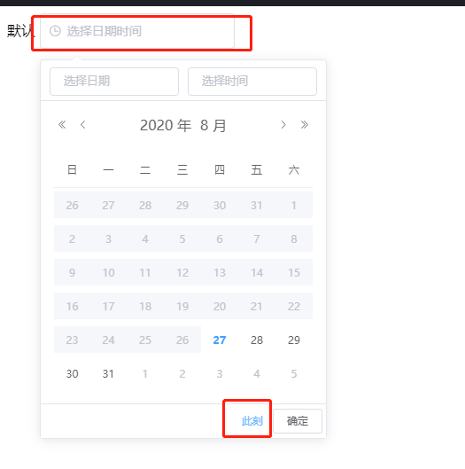

<h2>element ui中DateTimePicker坑</h2>

<pre>&lt;el-date-picker
      v-model="value1"
      type="datetime"
      placeholder="选择日期时间"
      value-format="yyyy-MM-dd HH:mm"
      format="yyyy-MM-dd HH:mm" :picker-options="{
         disabledDate: time =&gt; { 
              return time.getTime() &lt; new Date().getTime()  - 8.64e7
         },
         selectableRange: '10:00:00 - 23:59:59'
      }"&gt;    </pre>

当selectableRange&nbsp; format value-format 同时存在，点击此刻毫无反应

&nbsp;

&nbsp;

将&nbsp; format value-format 去掉，然后对获取到的标准时间值进行格式化

&nbsp;
