<h2 id="http协议简介">HTTP协议简介</h2>

超文本传输协议（英文：<strong>H</strong>yper<strong>T</strong>ext&nbsp;<strong>T</strong>ransfer&nbsp;<strong>P</strong>rotocol，缩写：HTTP）是一种用于分布式、协作式和超媒体信息系统的应用层协议。HTTP是万维网的数据通信的基础。

HTTP的发展是由蒂姆&middot;伯纳斯-李于1989年在欧洲核子研究组织（CERN）所发起。HTTP的标准制定由万维网协会（World Wide Web Consortium，W3C）和互联网工程任务组（Internet Engineering Task Force，IETF）进行协调，最终发布了一系列的RFC，其中最著名的是1999年6月公布的 RFC 2616，定义了HTTP协议中现今广泛使用的一个版本&mdash;&mdash;HTTP 1.1。

2014年12月，互联网工程任务组（IETF）的Hypertext Transfer Protocol Bis（httpbis）工作小组将HTTP/2标准提议递交至IESG进行讨论，于2015年2月17日被批准。 HTTP/2标准于2015年5月以RFC 7540正式发表，取代HTTP 1.1成为HTTP的实现标准。

<h2 id="http协议概述">HTTP协议概述</h2>

HTTP是一个客户端终端（用户）和服务器端（网站）请求和应答的标准（TCP）。通过使用网页浏览器、网络爬虫或者其它的工具，客户端发起一个HTTP请求到服务器上指定端口（默认端口为80）。我们称这个客户端为用户代理程序（user agent）。应答的服务器上存储着一些资源，比如HTML文件和图像。我们称这个应答服务器为源服务器（origin server）。在用户代理和源服务器中间可能存在多个&ldquo;中间层&rdquo;，比如代理服务器、网关或者隧道（tunnel）。

尽管TCP/IP协议是互联网上最流行的应用，HTTP协议中，并没有规定必须使用它或它支持的层。事实上，HTTP可以在任何互联网协议上，或其他网络上实现。HTTP假定其下层协议提供可靠的传输。因此，任何能够提供这种保证的协议都可以被其使用。因此也就是其在TCP/IP协议族使用TCP作为其传输层。

通常，由HTTP客户端发起一个请求，创建一个到服务器指定端口（默认是80端口）的TCP连接。HTTP服务器则在那个端口监听客户端的请求。一旦收到请求，服务器会向客户端返回一个状态，比如"HTTP/1.1 200 OK"，以及返回的内容，如请求的文件、错误消息、或者其它信息。

<h2 id="http工作原理">HTTP工作原理</h2>

HTTP协议定义Web客户端如何从Web服务器请求Web页面，以及服务器如何把Web页面传送给客户端。HTTP协议采用了请求/响应模型。客户端向服务器发送一个请求报文，请求报文包含请求的方法、URL、协议版本、请求头部和请求数据。服务器以一个状态行作为响应，响应的内容包括协议的版本、成功或者错误代码、服务器信息、响应头部和响应数据。

以下是 HTTP 请求/响应的步骤：

\1. 客户端连接到Web服务器 一个HTTP客户端，通常是浏览器，与Web服务器的HTTP端口（默认为80）建立一个TCP套接字连接。例如，<a href="http://www.luffycity.com/">http://www.luffycity.com</a>。

\2. 发送HTTP请求 通过TCP套接字，客户端向Web服务器发送一个文本的请求报文，一个请求报文由请求行、请求头部、空行和请求数据4部分组成。

\3. 服务器接受请求并返回HTTP响应 Web服务器解析请求，定位请求资源。服务器将资源复本写到TCP套接字，由客户端读取。一个响应由状态行、响应头部、空行和响应数据4部分组成。

\4. 释放连接TCP连接 若connection 模式为close，则服务器主动关闭TCP连接，客户端被动关闭连接，释放TCP连接;若connection 模式为keepalive，则该连接会保持一段时间，在该时间内可以继续接收请求;

\5. 客户端浏览器解析HTML内容 客户端浏览器首先解析状态行，查看表明请求是否成功的状态代码。然后解析每一个响应头，响应头告知以下为若干字节的HTML文档和文档的字符集。客户端浏览器读取响应数据HTML，根据HTML的语法对其进行格式化，并在浏览器窗口中显示。

例如：在浏览器地址栏键入URL，按下回车之后会经历以下流程：

<ol>
<li>浏览器向 DNS 服务器请求解析该 URL 中的域名所对应的 IP 地址;</li>
<li>解析出 IP 地址后，根据该 IP 地址和默认端口 80，和服务器建立TCP连接;</li>
<li>浏览器发出读取文件(URL 中域名后面部分对应的文件)的HTTP 请求，该请求报文作为 TCP 三次握手的第三个报文的数据发送给服务器;</li>
<li>服务器对浏览器请求作出响应，并把对应的 html 文本发送给浏览器;</li>
<li>释放 TCP连接;</li>
<li>浏览器将该 html 文本并显示内容; 　</li>

</ol>

　　

　　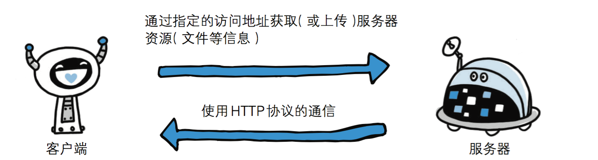

　　<strong>http协议是基于TCP/IP协议之上的应用层协议。</strong>

　　<strong>基于 请求-响应 的模式</strong>

　　　　HTTP协议规定,请求从客户端发出,最后服务器端响应该请求并 返回。换句话说,肯定是先从客户端开始建立通信的,服务器端在没有 接收到请求之前不会发送响应　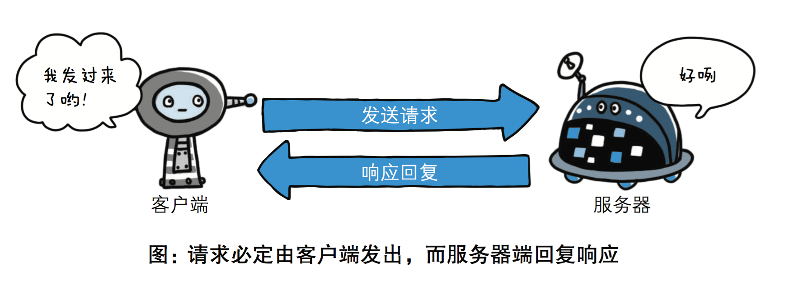

　　<strong>无状态保存</strong>

　　　　HTTP是一种不保存状态,即无状态(stateless)协议。HTTP协议 自身不对请求和响应之间的通信状态进行保存。也就是说在HTTP这个 级别,协议对于发送过的请求或响应都不做持久化处理。

　　　　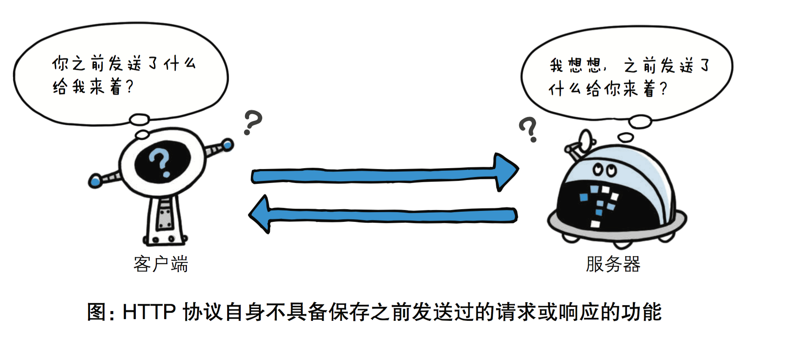

　　　　使用HTTP协议,每当有新的请求发送时,就会有对应的新响应产 生。协议本身并不保留之前一切的请求或响应报文的信息。这是为了更快地处理大量事务,确保协议的可伸缩性,而特意把HTTP协议设计成 如此简单的。可是,随着Web的不断发展,因无状态而导致业务处理变得棘手 的情况增多了。比如,用户登录到一家购物网站,即使他跳转到该站的 其他页面后,也需要能继续保持登录状态。针对这个实例,网站为了能 够掌握是谁送出的请求,需要保存用户的状态。HTTP/1.1虽然是无状态协议,但为了实现期望的保持状态功能, 于是引入了Cookie技术。有了Cookie再用HTTP协议通信,就可以管 理状态了。有关Cookie的详细内容稍后讲解。

　　<strong>无连接</strong>

　　　　无连接的含义是限制每次连接只处理一个请求。服务器处理完客户的请求，并收到客户的应答后，即断开连接。采用这种方式可以节省传输时间，并且可以提高并发性能，不能和每个用户建立长久的连接，请求一次相应一次，服务端和客户端就中断了。但是无连接有两种方式，早期的http协议是一个请求一个响应之后，直接就断开了，但是现在的http协议1.1版本不是直接就断开了，而是等几秒钟，这几秒钟是等什么呢，等着用户有后续的操作，如果用户在这几秒钟之内有新的请求，那么还是通过之前的连接通道来收发消息，如果过了这几秒钟用户没有发送新的请求，那么就会断开连接，这样可以提高效率，减少短时间内建立连接的次数，因为建立连接也是耗时的，默认的好像是3秒中现在，但是这个时间是可以通过咱们后端的代码来调整的，自己网站根据自己网站用户的行为来分析统计出一个最优的等待时间。

<h2 id="http请求方法">HTTP请求方法</h2>

HTTP/1.1协议中共定义了八种方法（也叫&ldquo;动作&rdquo;）来以不同方式操作指定的资源：

<h3 id="get">GET</h3>

向指定的资源发出&ldquo;显示&rdquo;请求。使用GET方法应该只用在读取数据，而不应当被用于产生&ldquo;副作用&rdquo;的操作中，例如在Web Application中。其中一个原因是GET可能会被网络蜘蛛等随意访问。

<h3 id="head">HEAD</h3>

与GET方法一样，都是向服务器发出指定资源的请求。只不过服务器将不传回资源的本文部分。它的好处在于，使用这个方法可以在不必传输全部内容的情况下，就可以获取其中&ldquo;关于该资源的信息&rdquo;（元信息或称元数据）。

<h3 id="post">POST</h3>

向指定资源提交数据，请求服务器进行处理（例如提交表单或者上传文件）。数据被包含在请求本文中。这个请求可能会创建新的资源或修改现有资源，或二者皆有。

<h3 id="put">PUT</h3>

向指定资源位置上传其最新内容。

<h3 id="delete">DELETE</h3>

请求服务器删除Request-URI所标识的资源。

<h3 id="trace">TRACE</h3>

回显服务器收到的请求，主要用于测试或诊断。

<h3 id="options">OPTIONS</h3>

这个方法可使服务器传回该资源所支持的所有HTTP请求方法。用'*'来代替资源名称，向Web服务器发送OPTIONS请求，可以测试服务器功能是否正常运作。

<h3 id="connect">CONNECT</h3>

HTTP/1.1协议中预留给能够将连接改为管道方式的代理服务器。通常用于SSL加密服务器的链接（经由非加密的HTTP代理服务器）。

注意事项：

<ol>
<li>方法名称是区分大小写的。当某个请求所针对的资源不支持对应的请求方法的时候，服务器应当返回状态码405（Method Not Allowed），当服务器不认识或者不支持对应的请求方法的时候，应当返回状态码501（Not Implemented）。</li>
<li>HTTP服务器至少应该实现GET和HEAD方法，其他方法都是可选的。当然，所有的方法支持的实现都应当匹配下述的方法各自的语义定义。此外，除了上述方法，特定的HTTP服务器还能够扩展自定义的方法。例如PATCH（由 RFC 5789 指定的方法）用于将局部修改应用到资源<em>。</em></li>

</ol>
<h4 id="请求方式-get与post请求（通过form表单我们自己写写看）">请求方式: get与post请求（通过form表单我们自己写写看）</h4>
<ul>
<li>

GET提交的数据会放在URL之后，也就是请求行里面，以?分割URL和传输数据，参数之间以&amp;相连，如EditBook?name=test1&amp;id=123456.（请求头里面那个content-type做的这种参数形式，后面讲） POST方法是把提交的数据放在HTTP包的请求体中.

</li>
<li>

GET提交的数据大小有限制（因为浏览器对URL的长度有限制），而POST方法提交的数据没有限制.

</li>
<li>

GET与POST请求在服务端获取请求数据方式不同，就是我们自己在服务端取请求数据的时候的方式不同了，这句废话昂。

</li>

</ul>
<h2 id="http状态码">HTTP状态码</h2>

所有HTTP响应的第一行都是状态行，依次是当前HTTP版本号，3位数字组成的状态代码，以及描述状态的短语，彼此由空格分隔。

状态代码的第一个数字代表当前响应的类型：

<ul>
<li>1xx消息&mdash;&mdash;请求已被服务器接收，继续处理</li>
<li>2xx成功&mdash;&mdash;请求已成功被服务器接收、理解、并接受</li>
<li>3xx重定向&mdash;&mdash;需要后续操作才能完成这一请求</li>
<li>4xx请求错误&mdash;&mdash;请求含有词法错误或者无法被执行</li>
<li>5xx服务器错误&mdash;&mdash;服务器在处理某个正确请求时发生错误</li>

</ul>

虽然 RFC 2616 中已经推荐了描述状态的短语，例如"200 OK"，"404 Not Found"，但是WEB开发者仍然能够自行决定采用何种短语，用以显示本地化的状态描述或者自定义信息。

　　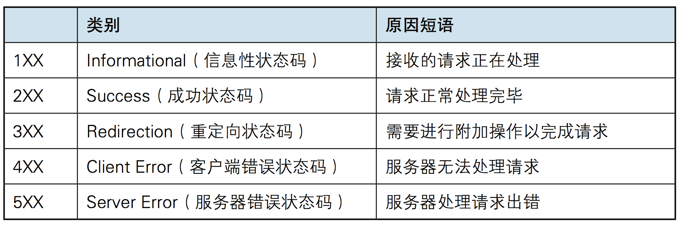

<h2 id="url">URL</h2>

超文本传输协议（HTTP）的统一资源定位符将从因特网获取信息的五个基本元素包括在一个简单的地址中：

<ul>
<li>传送协议。</li>
<li>层级URL标记符号(为[//],固定不变)</li>
<li>访问资源需要的凭证信息（可省略）</li>
<li>服务器。（通常为域名，有时为IP地址）</li>
<li>端口号。（以数字方式表示，若为HTTP的默认值&ldquo;:80&rdquo;可省略）</li>
<li>路径。（以&ldquo;/&rdquo;字符区别路径中的每一个目录名称）</li>
<li>查询。（GET模式的窗体参数，以&ldquo;?&rdquo;字符为起点，每个参数以&ldquo;&amp;&rdquo;隔开，再以&ldquo;=&rdquo;分开参数名称与数据，通常以UTF8的URL编码，避开字符冲突的问题）</li>
<li>片段。以&ldquo;#&rdquo;字符为起点</li>

</ul>

以http://www.luffycity.com:80/news/index.html?id=250&amp;page=1 为例, 其中：

http，是协议； www.luffycity.com，是服务器； 80，是服务器上的默认网络端口号，默认不显示； /news/index.html，是路径（URI：直接定位到对应的资源）； ?id=250&amp;page=1，是查询。 大多数网页浏览器不要求用户输入网页中&ldquo;http://&rdquo;的部分，因为绝大多数网页内容是超文本传输协议文件。同样，&ldquo;80&rdquo;是超文本传输协议文件的常用端口号，因此一般也不必写明。一般来说用户只要键入统一资源定位符的一部分（www.luffycity.com:80/news/index.html?id=250&amp;page=1）就可以了。

由于超文本传输协议允许服务器将浏览器重定向到另一个网页地址，因此许多服务器允许用户省略网页地址中的部分，比如 www。从技术上来说这样省略后的网页地址实际上是一个不同的网页地址，浏览器本身无法决定这个新地址是否通，服务器必须完成重定向的任务。

<h2 id="http请求格式请求协议">HTTP请求格式(请求协议)</h2>

　　　　

　　　　　URL包含：/index/index2?a=1&amp;b=2；路径和参数都在这里。

　　　　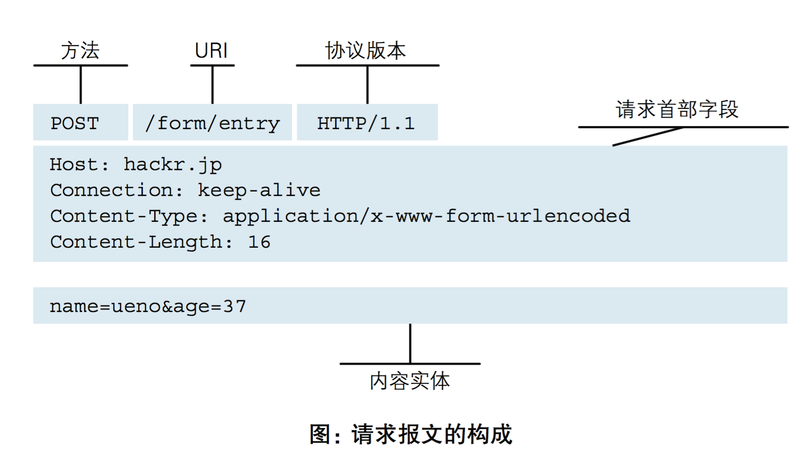

　　　　　　请求头里面的内容举个例子：这个length表示请求体里面的数据长度，其他的请求头里面的这些键值对，陆续我们会讲的，大概知道一下就可以了，其中有一个user-agent，算是需要你记住的吧，就是告诉你的服务端，我是用什么给你发送的请求。

　　　　　　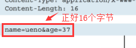

　　　　　　

　　　　　　以京东为例，看一下user-agent

　　　　　　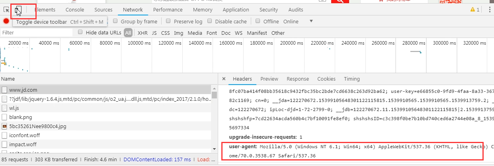

　　　　　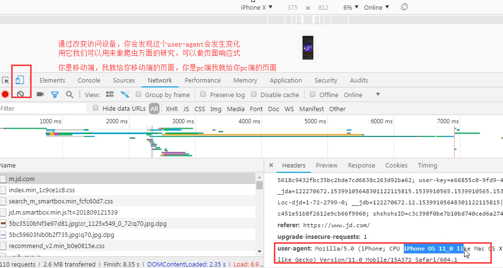

　　　　　　看一个爬虫的例子，爬京东的时候没问题，但是爬抽屉的时候必须带着user-agent，因为抽屉对user-agent做了判断，来判断你是不是一个正常的请求，算是反扒机制的一种。

　　　　　　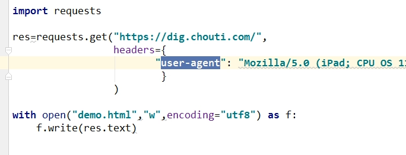

　　　　　　打开我们保存的demo.html文件，然后通过浏览器打开看看就能看到页面效果。

　　　　　　写上面这些内容的意思是让你知道有这么个请求头的存在，有些是有意义的，请求头我们还可以自己定义，就在requests模块里面那个headers={}，这个字典里面加就行。

　　　　　　

　　

<h2 id="http响应格式（响应协议）">HTTP响应格式（响应协议）</h2>

　　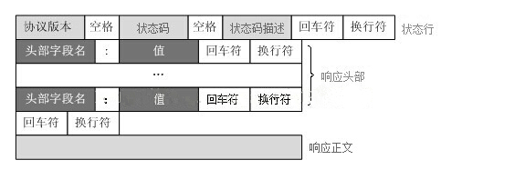

　　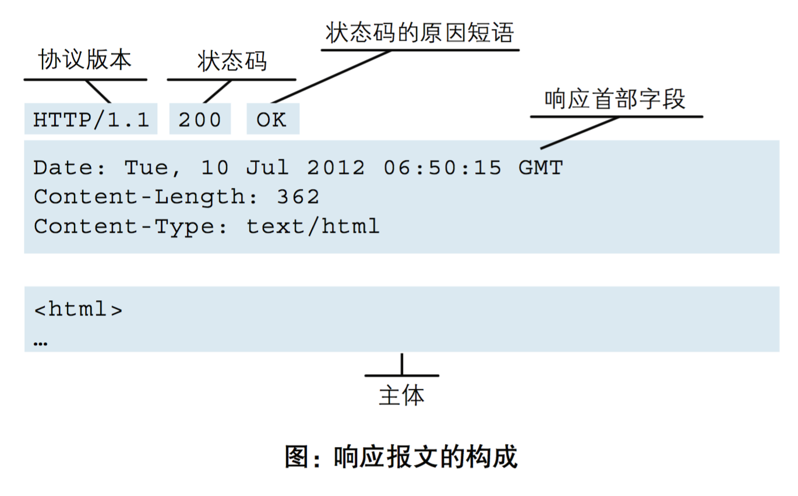

&nbsp;

<h2>COOKIE和SESSION有什么区别</h2>
<h3>Cookie</h3>

　　HTTP是无状态协议， 它不对之前发生过的请求和响应的状态进行管理。 也就是说，无法根据之前的状态进行本次的请求处理。假设要求登录认证的Web页面本身无法进行状态的管理（不记录已登录的状态）， 那么每次跳转新页面不是要再次登录， 就是要在每次请求报文中附加参数来管理登录状态。不可否认， 无状态协议当然也有它的优点。 由于不必保存状态， 自然可减少服务器的CPU及内存资源的消耗。 从另一侧面来说， 也正是因为HTTP协议本身是非常简单的， 所以才会被应用在各种场景里。保留无状态协议这个特征的同时又要解决类似的矛盾问题，于是引入了Cookie技术。Cookie技术通过在请求和响应报文中写入Cookie信息来控制客户端的状态。Cookie会根据从服务器端发送的响应报文内的一个叫做Set-Cookie 的首部字段信息，通知客户端保存Cookie。 当下次客户端再往该服务器发送请求时，客户端会自动在请求报文中加入Cookie值后发送出去。服务器端发现客户端发送过来的Cookie 后，会去检查究竟是从哪一个客户端发来的连接请求， 然后对比服务器上的记录， 最后得到之前的状态信息。

<h3>Session</h3>

　　主要是讲先前用户信息记录在服务器端，并且生成唯一的Session-ID号，客户端仅仅需要在每次访问的时候，提供对应的ID号码，即可从服务器获取先前存储的对应信息。

　　由于HTTP协议是无状态的协议，所以服务端需要记录用户的状态时，就需要用某种机制来识具体的用户，这个机制就是Session.典型的场景比如购物车，当你点击下单按钮时，由于HTTP协议无状态，所以并不知道是哪个用户操作的，所以服务端要为特定的用户创建了特定的Session，用用于标识这个用户，并且跟踪用户，这样才知道购物车里面有几本书。这个Session是保存在服务端的，有一个唯一标识。在服务端保存Session的方法很多，内存、数据库、文件都有。集群的时候也要考虑Session的转移，在大型的网站，一般会有专门的Session服务器集群，用来保存用户会话，这个时候 Session 信息都是放在内存的，使用一些缓存服务比如Memcached之类的来放 Session。 　　

　　思考一下服务端如何识别特定的客户？这个时候Cookie就登场了。每次HTTP请求的时候，客户端都会发送相应的Cookie信息到服务端。实际上大多数的应用都是用 Cookie 来实现Session跟踪的，第一次创建Session的时候，服务端会在HTTP协议中告诉客户端，需要在 Cookie 里面记录一个Session ID，以后每次请求把这个会话ID发送到服务器，我就知道你是谁了。有人问，如果客户端的浏览器禁用了 Cookie 怎么办？一般这种情况下，会使用一种叫做URL重写的技术来进行会话跟踪，即每次HTTP交互，URL后面都会被附加上一个诸如 sid=xxxxx 这样的参数，服务端据此来识别用户。 　　Cookie其实还可以用在一些方便用户的场景下，设想你某次登陆过一个网站，下次登录的时候不想再次输入账号了，怎么办？这个信息可以写到Cookie里面，访问网站的时候，网站页面的脚本可以读取这个信息，就自动帮你把用户名给填了，能够方便一下用户。这也是Cookie名称的由来，给用户的一点甜头。所以，总结一下：Session是在服务端保存的一个数据结构，用来跟踪用户的状态，这个数据可以保存在集群、数据库、文件中；Cookie是客户端保存用户信息的一种机制，用来记录用户的一些信息，也是实现Session的一种方式。 总体来说Cookie和Session的区别： 　　cookie数据存放在客户的浏览器上，session数据放在服务器上； 　　cookie不是很安全，别人可以分析存放在本地的cookie并进行cookie欺骗，考虑到安全应当使用session； 　　session会在一定时间内保存在服务器上。当访问增多，会比较占用你服务器的性能。考虑到减轻服务器性能方面，应当使用cookie； 　　单个cookie在客户端的限制是3K，就是说一个站点在客户端存放的COOKIE不能超过3K；

<h2>HTTP中的重定向和请求转发的区别</h2>
<h2 class="cnt">本质区别</h2>
<h5>解释一　　</h5>

一句话，转发是服务器行为，重定向是客户端行为。为什么这样说呢，这就要看两个动作的工作流程：

转发过程：客户浏览器发送http请求----》web服务器接受此请求--》调用内部的一个方法在容器内部完成请求处理和转发动作----》将目标资源发送给客户；在这里，转发的路径必须是同一个web容器下的url，其不能转向到其他的web路径上去，中间传递的是自己的容器内的request。在客户浏览器路径栏显示的仍然是其第一次访问的路径，也就是说客户是感觉不到服务器做了转发的。转发行为是浏览器只做了一次访问请求。

重定向过程：客户浏览器发送http请求----》web服务器接受后发送302状态码响应及对应新的location给客户浏览器--》客户浏览器发现是302响应，则自动再发送一个新的http请求，请求url是新的location地址----》服务器根据此请求寻找资源并发送给客户。在这里location可以重定向到任意URL，既然是浏览器重新发出了请求，则就没有什么request传递的概念了。在客户浏览器路径栏显示的是其重定向的路径，客户可以观察到地址的变化的。重定向行为是浏览器做了至少两次的访问请求的。

解释二

重定向，其实是两次request,&nbsp; 第一次，客户端request &nbsp; A,服务器响应，并response回来，告诉浏览器，你应该去B。这个时候IE可以看到地址变了，而且历史的回退按钮也亮了。重定向可以访问自己web应用以外的资源。在重定向的过程中，传输的信息会被丢失。

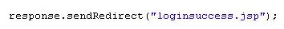 请求转发是服务器内部把对一个request/response的处理权，移交给另外一个&nbsp; 对于客户端而言，它只知道自己最早请求的那个A，而不知道中间的B，甚至C、D。&nbsp;传输的信息不会丢失。

<h3 class="cnt">解释三</h3>

假设你去办理某个执照，&nbsp;  重定向：你先去了A局，A局的人说：&ldquo;这个事情不归我们管，去B局&rdquo;，然后，你就从A退了出来，自己乘车去了B局。&nbsp;  转发：你先去了A局，A局看了以后，知道这个事情其实应该B局来管，但是他没有把你退回来，而是让你坐一会儿，自己到后面办公室联系了B的人，让他们办好后，送了过来。

&nbsp;

转载自

&nbsp;<a href="https://www.cnblogs.com/an-wen/p/11180076.html">https://www.cnblogs.com/an-wen/p/11180076.html</a>

<a href="https://blog.csdn.net/u010710458/java/article/details/79636625" target="_blank">https://blog.csdn.net/u010710458/java/article/details/79636625</a>

<a href="https://blog.csdn.net/cai784921129/article/details/80177753">https://blog.csdn.net/cai784921129/article/details/80177753</a>
