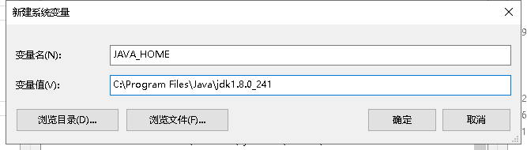
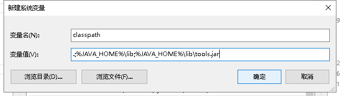
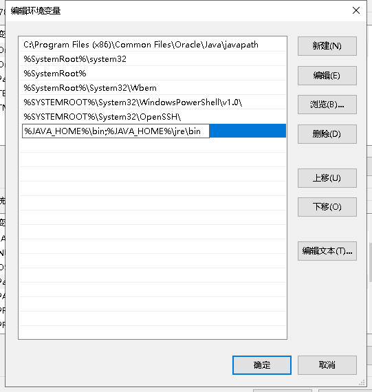
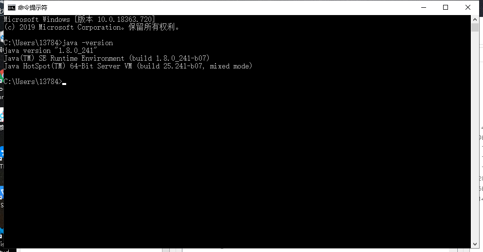
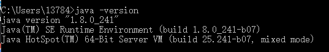
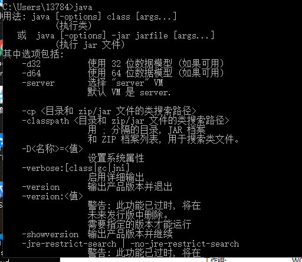

<ol>
<li>oracle的jdk下载需要登录，<a href="https://blog.csdn.net/qq_40298231/article/details/98485608">https://blog.csdn.net/qq_40298231/article/details/98485608</a></li>
<li>安装JDK，傻瓜式操作</li>
<li>配置环境变量</li>
</ol>

　　　　右击&ldquo;我的电脑&rdquo;--&gt;"属性"--&gt;"高级系统设置"--&gt;"高级"--&gt;"环境变量"&nbsp;

<ul>
<li style="list-style-type: none;">
<ul>
<li>　　在系统变量里新建"JAVA_HOME"变量，变量值为：C:\Program Files\Java\jdk1.8.0_241（JDK的安装路径）；</li>
<li>　　在系统变量里新建"classpath"变量</li>
</ul>
</li>
</ul>
<pre>　　　　　　　　.;%JAVA_HOME%\lib;%JAVA_HOME%\lib\tools.jar </pre>
<ul>
<li style="list-style-type: none;">
<ul>
<li>　　找到path变量（已存在不用新建）添加变量值（win10直接新建不需要加；）</li>
</ul>
</li>
</ul>

　　　　　　　　%JAVA_HOME%\bin;%JAVA_HOME%\jre\bin

　　　　　　

&nbsp;

&nbsp;

&nbsp;　　　　　　

&nbsp;

　　　　　　　

&nbsp;

&nbsp;

&nbsp;

　　4.&nbsp; &nbsp;&nbsp;测试是否成功

　　　　java -version

　　　　&nbsp;

&nbsp;

&nbsp;

<h3>打开cmd,输入java，java -version没有问题，但是javac提示不是内部命令</h3>

&nbsp;

&nbsp;

&nbsp;

&nbsp;

&nbsp;

<ul>
<li>&nbsp;找到java安装下的bin目录，运行cmd,输入javac，能提示，说明环境配置有问题</li>
</ul>

&nbsp;<a href="https://blog.csdn.net/qq_40670946/article/details/90200364">https://blog.csdn.net/qq_40670946/article/details/90200364</a>参考此处
