<h1>转载&nbsp;<a href="https://www.cnblogs.com/winton-nfs/p/11524007.html">https://www.cnblogs.com/winton-nfs/p/11524007.html</a></h1>
<h1>免安装版的Mysql</h1>

　　MySQL关是一种关系数据库管理系统，所使用的 SQL 语言是用于访问<a href="https://baike.baidu.com/item/%E6%95%B0%E6%8D%AE%E5%BA%93/103728" target="_blank" data-lemmaid="103728">数据库</a>的最常用的

标准化语言，其特点为体积小、速度快、总体拥有成本低，尤其是<a href="https://baike.baidu.com/item/%E5%BC%80%E6%94%BE%E6%BA%90%E7%A0%81/7176422" target="_blank" data-lemmaid="7176422">开放源码</a>这一特点，在 Web

应用方面 MySQL 是最好的 RDBMS(Relational Database Management System：关系数据

库管理系统)应用软件之一。

&nbsp;

<strong>　　</strong>在本博文里，我主要以Mysql免安装版为例，帮助大家解决安装与配置mysql的步骤。

&nbsp;

　　首先：要先进入mysql官网里（Mysql的官网--&gt;<a title="Mysql官网" href="https://www.mysql.com/" target="_blank">https://www.mysql.com/</a>），下面是详细步骤：&darr;

　　(为了方便大家的操作，我的网盘里有安装包：

　　　　链接：<a title="安装包" href="https://pan.baidu.com/s/1_v98A_7aA1IBjzofuOqj0A%20" target="_blank">https://pan.baidu.com/s/1_v98A_7aA1IBjzofuOqj0A</a> 　　　　提取码：ic4v 　　)

&nbsp;

&nbsp;

<h2><strong>一：下载安装包：</strong></h2>

&nbsp;

<strong>　　</strong>①进入官网后，点击"Dowload"，然后页面往下拉

<strong>　　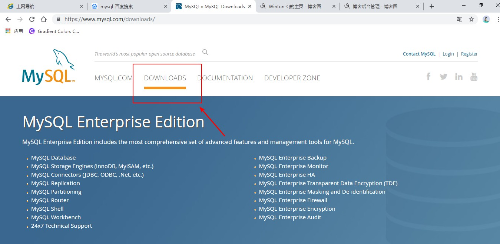</strong>

　　

&nbsp;

　　②接下来看到的页面是这样的，红色框框的链接就是mysql社区版，是免费的mysql版本，然后我们点击这个框框的链接：&darr;

&nbsp;

　　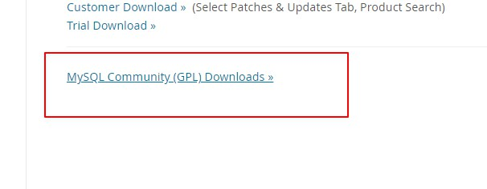

&nbsp;

&nbsp;

　　　&nbsp;③接下来跳转到这个页面，在这里，我们只要下载社区版的Server就可以了：&darr;

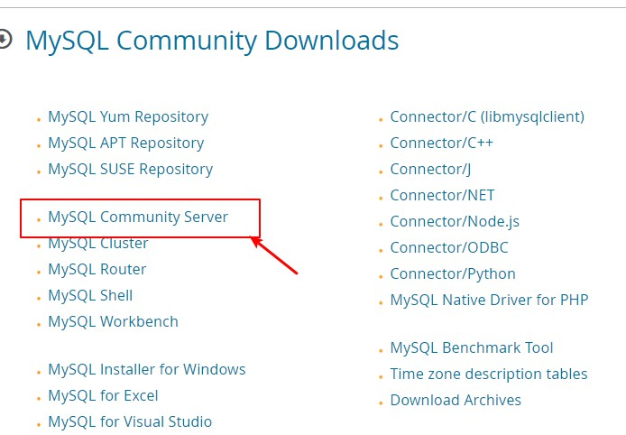

&nbsp;

&nbsp;

　　④下载免安装版(windows以外的其他系统除外)

&nbsp;

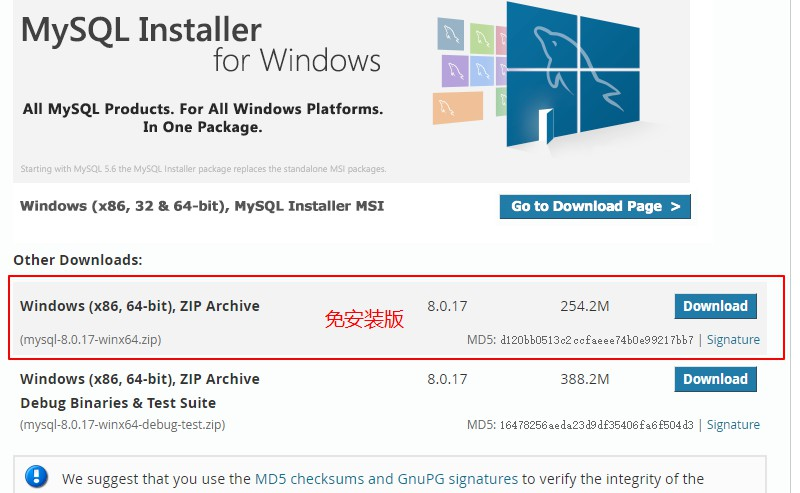

&nbsp;

&nbsp;

<h3>　　</h3>
<h3><strong>　</strong>　***这样，安装包就下载好了！</h3>
<h3>　　***注意，安装的目录应当放在指定位置，，其次，绝对路径中避免出现中文，推荐首选英文为命名条件！！！！(我的为参考)</h3>

<strong>　　</strong>

<strong>　　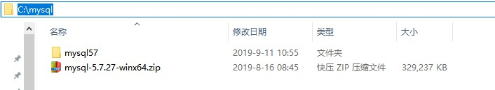</strong>

&nbsp;

<h2>　</h2>

　　

<h2><strong>二：Mysql的配置</strong></h2>

<strong>　　*以管理员身份打开命令行(如下图所示)</strong>

<strong>　　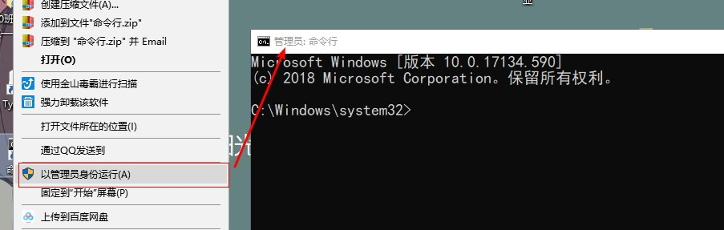</strong>

<strong>　　</strong>

&nbsp;

<strong>　</strong>　①下转到mysql的bin目录下：<strong> </strong>

&nbsp;

　　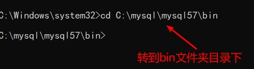

&nbsp;

　　②安装mysql的服务：mysqld --install

&nbsp;

　　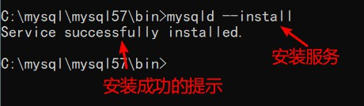

　　

&nbsp;

　　③初始化mysql，在这里，初始化会产生一个随机密码,如下图框框所示，记住这个密码，后面会用到(mysqld --initialize --console)

　　

　　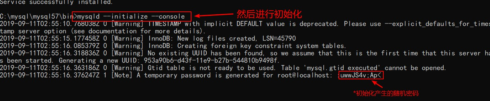

　　

　　④开启mysql的服务(net start mysql)

&nbsp;

　　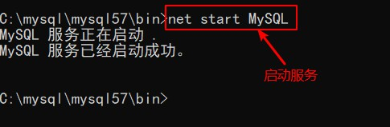

&nbsp;

&nbsp;

　　⑤登录验证，mysql是否安装成功！(要注意上面产生的随机密码，不包括前面符号前面的空格，否则会登陆失败)，如果和下图所示一样，则说明你的mysql已经安装成功！注意，，一定要先开启服务，不然会登陆失败，出现拒绝访问的提示符！！！

&nbsp;

　　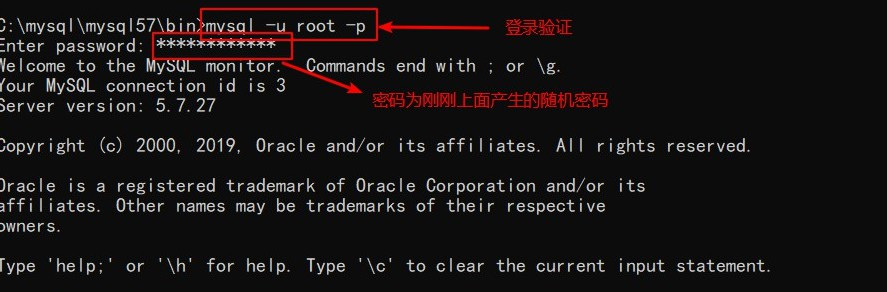

&nbsp;

&nbsp;

　　

<h4>　　修改密码：</h4>

　　　　由于初始化产生的随机密码太复杂，，不便于我们登录mysql，因此，我们应当修改一个自己能记住的密码！！

&nbsp;

　　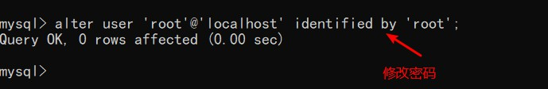

&nbsp;

&nbsp;

　　再次登录验证新密码：

&nbsp;

　　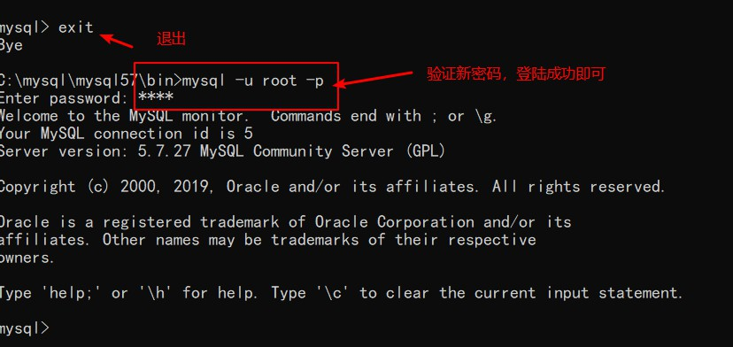

&nbsp;

&nbsp;

　　<strong>设置系统的全局变量：</strong>

<strong>　　　　</strong>为了方便登录操作mysql，在这里我们设置一个全局变量：&darr;

&nbsp;

　　　　①点击"我的电脑"--&gt;"属性"--&gt;''高级系统设置''--&gt;''环境变量'',接下来如下图所操作

　　

　　　　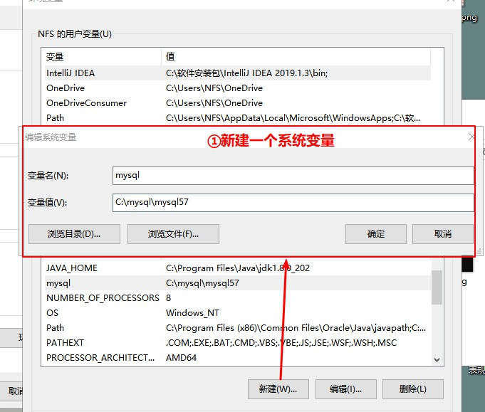

&nbsp;

&nbsp;

　　　　②把新建的mysql变量添加到Path路径变量中，点击确定，即完成：

&nbsp;

　　　　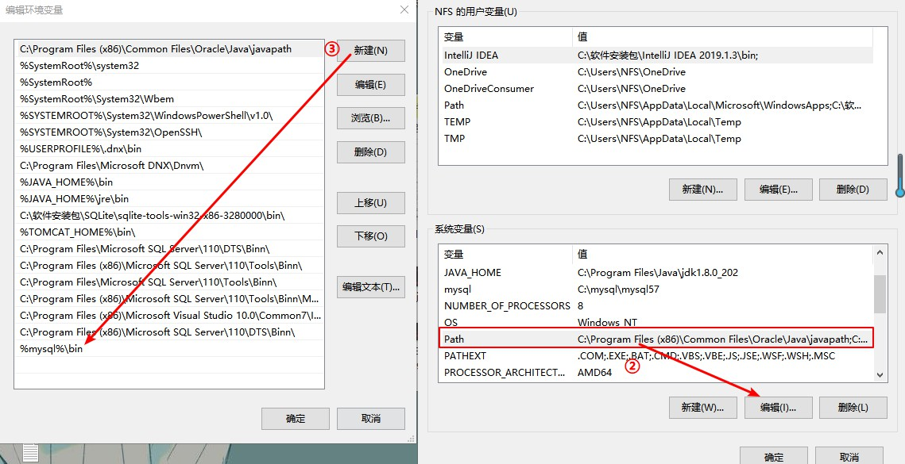

&nbsp;

　　　　

　　　　配置完成之后，每当我们想要用命令行使用mysql时，只需要win+R，--&gt;输入"cmd"打开命令行，之后输入登录sql语句即可。

&nbsp;

　　

　　　　③在mysql目录下创建一个ini或cnf配置文件，在这里我创建的是ini配置文件，里面写的代码是mysql的一些基本配置

&nbsp;

　　　　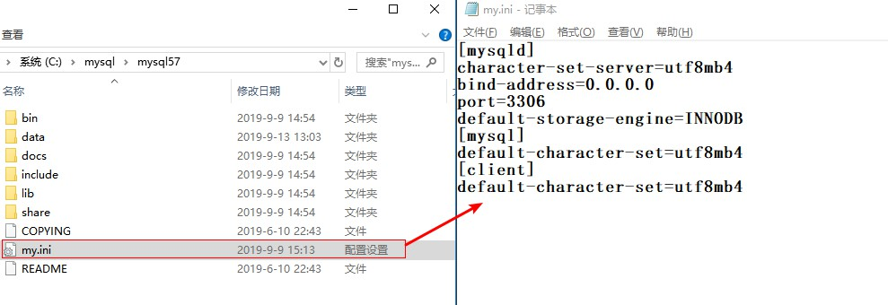

&nbsp;

&nbsp;

　　就这样，一个免安装版的Mysql就安装并配置完成了，初学者，尽量不要用mysql的编译器，，推荐用命令行练习至熟练~

&nbsp;

&nbsp;

<h2><strong>参考：</strong></h2>

&nbsp;

<h3><strong>　　①安装服务：</strong>mysqld --install</h3>
<h3>&nbsp;</h3>
<h3><strong>　　②<strong>初始化：　</strong></strong>mysqld --initialize --console</h3>
<h3>&nbsp;</h3>
<h3><strong>　　③开启服务：</strong>net start mysql</h3>
<h3>&nbsp;</h3>
<h3><strong><strong>　　④关闭<strong><strong>服务：</strong></strong></strong></strong>net stop mysql</h3>
<h3>&nbsp;</h3>
<h3><strong>　　⑤登录mysql：</strong>mysql -u root -p</h3>
<h3>&nbsp;</h3>
<h3><strong>　　　　Enter PassWord：(</strong>密码<strong>)</strong></h3>
<h3>&nbsp;</h3>
<h3><strong>　　⑥修改密码：</strong>alter user 'root'@'localhost' identified by 'root';(by 接着的是密码)</h3>
<h3>&nbsp;</h3>
<h3>　　<strong>⑦标记删除mysql服务</strong>：sc delete mysql</h3>