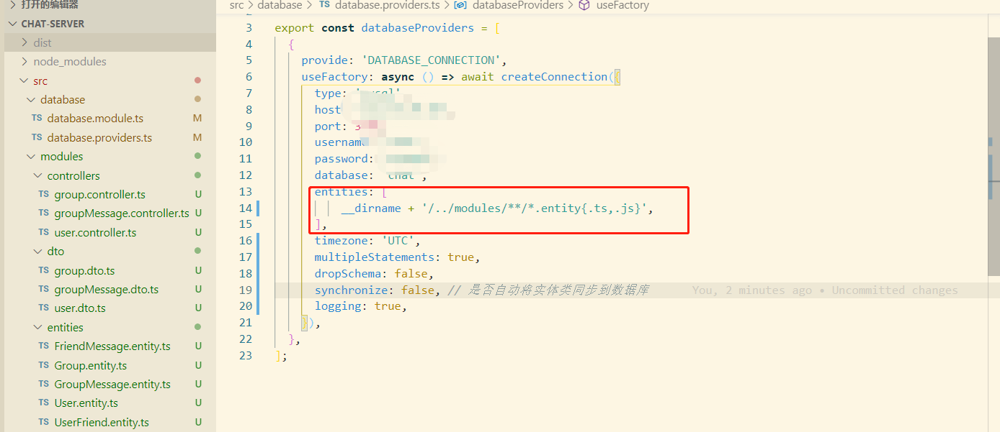

<pre>[Nest] 6336   - 2021-01-06 2:36:25 ├F10: PM┤   [ExceptionHandler] No repository for "User" was found. Looks like this entity is not registered in current "default" connection? +3ms
RepositoryNotFoundError: No repository for "User" was found. Looks like this entity is not registered in current "default" connection?
    at new RepositoryNotFoundError (D:\YYH\nest\project-name\chat-server\node_modules\typeorm\error\RepositoryNotFoundError.js:11:28)
    at EntityManager.getRepository (D:\YYH\nest\project-name\chat-server\node_modules\typeorm\entity-manager\EntityManager.js:660:19)
    at Connection.getRepository (D:\YYH\nest\project-name\chat-server\node_modules\typeorm\connection\Connection.js:367:29)
    at InstanceWrapper.useFactory [as metatype] (D:\YYH\nest\project-name\chat-server\dist\modules\providers\user.providers.js:8:48)
    at Injector.instantiateClass (D:\YYH\nest\project-name\chat-server\node_modules\@nestjs\core\injector\injector.js:289:55)
    at callback (D:\YYH\nest\project-name\chat-server\node_modules\@nestjs\core\injector\injector.js:42:41)        
    at processTicksAndRejections (internal/process/task_queues.js:97:5)
    at async Injector.resolveConstructorParams (D:\YYH\nest\project-name\chat-server\node_modules\@nestjs\core\injector\injector.js:114:24)
    at async Injector.loadInstance (D:\YYH\nest\project-name\chat-server\node_modules\@nestjs\core\injector\injector.js:46:9)
    at async Injector.loadProvider (D:\YYH\nest\project-name\chat-server\node_modules\@nestjs\core\injector\injector.js:68:9)</pre>

View Code

此报错是由于我修改了原本的目录结构

解决方法：

&nbsp;

<h2>&nbsp;../ 非常重要不能忽略</h2>