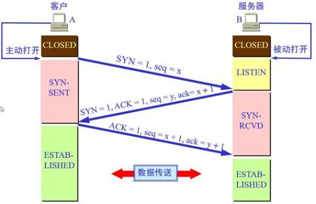
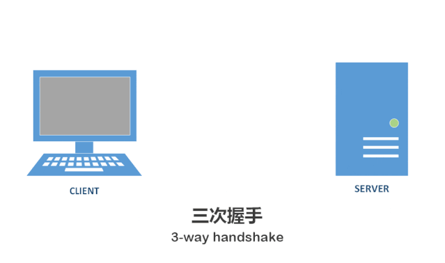
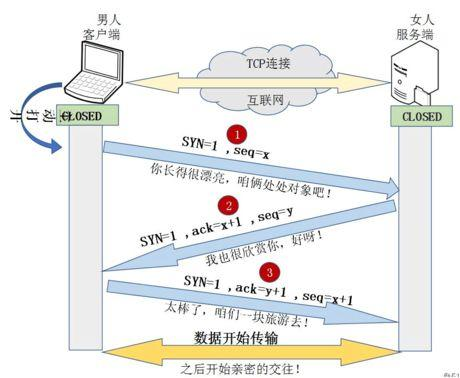
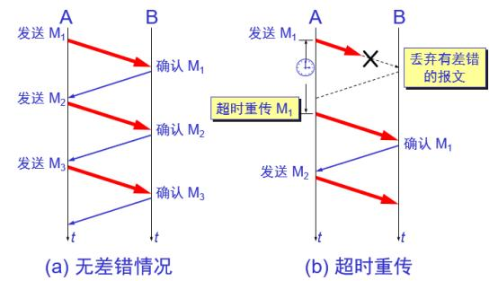
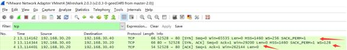
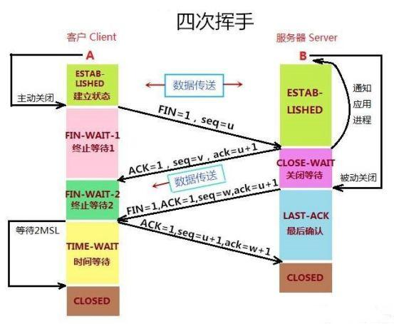
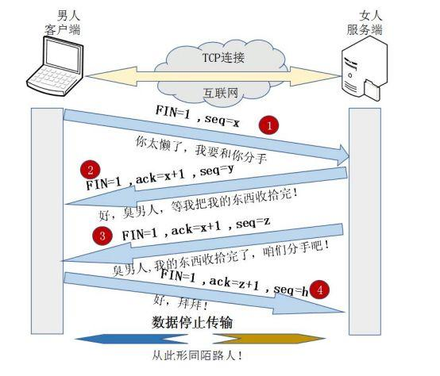

<h2>TCP的三次握手（Three-Way Handshake）</h2>
<h3>1.&rdquo;三次握手&rdquo;的详解</h3>

所谓的三次握手即TCP连接的建立。这个连接必须是一方主动打开，另一方被动打开的。以下为客户端主动发起连接的图解：

&nbsp;

&nbsp;

握手之前主动打开连接的客户端结束CLOSED阶段，被动打开的服务器端也结束CLOSED阶段，并进入LISTEN阶段。随后开始&ldquo;三次握手&rdquo;：

（1）首先客户端向服务器端发送一段TCP报文，其中：

　　标记位为SYN，表示&ldquo;请求建立新连接&rdquo;;序号为Seq=X（X一般为1）；随后客户端进入SYN-SENT阶段。

（2）服务器端接收到来自客户端的TCP报文之后，结束LISTEN阶段。并返回一段TCP报文，其中：

　　标志位为SYN和ACK，表示&ldquo;确认客户端的报文Seq序号有效，服务器能正常接收客户端发送的数据，并同意创建新连接&rdquo;（即告诉客户端，服务器收到了你的数据）；序号为Seq=y；确认号为Ack=x+1，表示收到客户端的序号Seq并将其值加1作为自己确认号Ack的值；随后服务器端进入SYN-RCVD阶段。

（3）客户端接收到来自服务器端的确认收到数据的TCP报文之后，明确了从客户端到服务器的数据传输是正常的，结束SYN-SENT阶段。并返回最后一段TCP报文。其中：

　　标志位为ACK，表示&ldquo;确认收到服务器端同意连接的信号&rdquo;（即告诉服务器，我知道你收到我发的数据了）；序号为Seq=x+1，表示收到服务器端的确认号Ack，并将其值作为自己的序号值；确认号为Ack=y+1，表示收到服务器端序号Seq，并将其值加1作为自己的确认号Ack的值；随后客户端进入ESTABLISHED阶段。服务器收到来自客户端的&ldquo;确认收到服务器数据&rdquo;的TCP报文之后，明确了从服务器到客户端的数据传输是正常的。结束SYN-SENT阶段，进入ESTABLISHED阶段。

在客户端与服务器端传输的TCP报文中，双方的确认号Ack和序号Seq的值，都是在彼此Ack和Seq值的基础上进行计算的，这样做保证了TCP报文传输的连贯性。一旦出现某一方发出的TCP报文丢失，便无法继续"握手"，以此确保了"三次握手"的顺利完成。

此后客户端和服务器端进行正常的数据传输。这就是&ldquo;三次握手&rdquo;的过程。

<h3>2.&ldquo;三次握手&rdquo;的动态过程</h3>

<h3>3.&ldquo;三次握手&rdquo;的通俗理解</h3>

&nbsp;

&nbsp;

举个栗子：把客户端比作男孩，服务器比作女孩。用他们的交往来说明&ldquo;三次握手&rdquo;过程：

（1）男孩喜欢女孩，于是写了一封信告诉女孩：我爱你，请和我交往吧！;写完信之后，男孩焦急地等待，因为不知道信能否顺利传达给女孩。

（2）女孩收到男孩的情书后，心花怒放，原来我们是两情相悦呀！于是给男孩写了一封回信：我收到你的情书了，也明白了你的心意，其实，我也喜欢你！我愿意和你交往！;

写完信之后，女孩也焦急地等待，因为不知道回信能否能顺利传达给男孩。

（3）男孩收到回信之后很开心，因为发出的情书女孩收到了，并且从回信中知道了女孩喜欢自己，并且愿意和自己交往。然后男孩又写了一封信告诉女孩：你的心意和信我都收到了，谢谢你，还有我爱你！

女孩收到男孩的回信之后，也很开心，因为发出的情书男孩收到了。由此男孩女孩双方都知道了彼此的心意，之后就快乐地交流起来了~~

这就是通俗版的&ldquo;三次握手&rdquo;，期间一共往来了三封信也就是&ldquo;三次握手&rdquo;，以此确认两个方向上的数据传输通道是否正常。

<h3>4.为什么要进行第三次握手？</h3>

为了防止服务器端开启一些无用的连接增加服务器开销以及防止已失效的连接请求报文段突然又传送到了服务端，因而产生错误。

由于网络传输是有延时的(要通过网络光纤和各种中间代理服务器)，在传输的过程中，比如客户端发起了SYN=1创建连接的请求(第一次握手)。

如果服务器端就直接创建了这个连接并返回包含SYN、ACK和Seq等内容的数据包给客户端，这个数据包因为网络传输的原因丢失了，丢失之后客户端就一直没有接收到服务器返回的数据包。

客户端可能设置了一个超时时间，时间到了就关闭了连接创建的请求。再重新发出创建连接的请求，而服务器端是不知道的，如果没有第三次握手告诉服务器端客户端收的到服务器端传输的数据的话，

服务器端是不知道客户端有没有接收到服务器端返回的信息的。

这个过程可理解为：

这样没有给服务器端一个创建还是关闭连接端口的请求，服务器端的端口就一直开着，等到客户端因超时重新发出请求时，服务器就会重新开启一个端口连接。那么服务器端上没有接收到请求数据的上一个端口就一直开着，长此以往，这样的端口多了，就会造成服务器端开销的严重浪费。

还有一种情况是已经失效的客户端发出的请求信息，由于某种原因传输到了服务器端，服务器端以为是客户端发出的有效请求，接收后产生错误。

所以我们需要&ldquo;第三次握手&rdquo;来确认这个过程，让客户端和服务器端能够及时地察觉到因为网络等一些问题导致的连接创建失败，这样服务器端的端口就可以关闭了不用一直等待。

也可以这样理解：&ldquo;第三次握手&rdquo;是客户端向服务器端发送数据，这个数据就是要告诉服务器，客户端有没有收到服务器&ldquo;第二次握手&rdquo;时传过去的数据。若发送的这个数据是&ldquo;收到了&rdquo;的信息，接收后服务器就正常建立TCP连接，否则建立TCP连接失败，服务器关闭连接端口。由此减少服务器开销和接收到失效请求发生的错误。

<h3>5.抓包验证</h3>

下面是用抓包工具抓到的一些数据包，可用来分析TCP的三次握手：

图中显示的就是完整的TCP连接的&rdquo;三次握手&rdquo;过程。在52528 -&gt; 80中，52528是本地(客户端)端口，80是服务器的端口。80端口和52528端口之间的三次来回就是"三次握手"过程。

注意到&rdquo;第一次握手&rdquo;客户端发送的TCP报文中以[SYN]作为标志位，并且客户端序号Seq=0；

接下来&rdquo;第二次握手&rdquo;服务器返回的TCP报文中以[SYN，ACK]作为标志位；并且服务器端序号Seq=0；确认号Ack=1(&ldquo;第一次握手&rdquo;中客户端序号Seq的值+1);

最后&rdquo;第三次握手&rdquo;客户端再向服务器端发送的TCP报文中以[ACK]作为标志位；

其中客户端序号Seq=1（&ldquo;第二次握手&rdquo;中服务器端确认号Ack的值）；确认号Ack=1(&ldquo;第二次握手&rdquo;中服务器端序号Seq的值+1)。

这就完成了&rdquo;三次握手&rdquo;的过程，符合前面分析的结果。

<h2>TCP的四次挥手（Four-Way Wavehand）</h2>
<h3>1、前言</h3>

对于"三次握手"我们耳熟能详，因为其相对的简单。但是，我们却不常听见&ldquo;四次挥手&rdquo;，就算听过也未必能详细地说明白它的具体过程。下面就为大家详尽，直观，完整地介绍&ldquo;四次挥手&rdquo;的过程。

<h3>2、&ldquo;四次挥手&rdquo;的详解</h3>

所谓的四次挥手即TCP连接的释放(解除)。连接的释放必须是一方主动释放，另一方被动释放。以下为客户端主动发起释放连接的图解：

&nbsp;

&nbsp;

挥手之前主动释放连接的客户端结束ESTABLISHED阶段。随后开始&ldquo;四次挥手&rdquo;：

（1）首先客户端想要释放连接，向服务器端发送一段TCP报文，其中：

标记位为FIN，表示&ldquo;请求释放连接&ldquo;；序号为Seq=U；随后客户端进入FIN-WAIT-1阶段，即半关闭阶段。并且停止在客户端到服务器端方向上发送数据，但是客户端仍然能接收从服务器端传输过来的数据。注意：这里不发送的是正常连接时传输的数据(非确认报文)，而不是一切数据，所以客户端仍然能发送ACK确认报文。

（2）服务器端接收到从客户端发出的TCP报文之后，确认了客户端想要释放连接，随后服务器端结束ESTABLISHED阶段，进入CLOSE-WAIT阶段（半关闭状态）并返回一段TCP报文，其中：

标记位为ACK，表示&ldquo;接收到客户端发送的释放连接的请求&rdquo;；序号为Seq=V；确认号为Ack=U+1，表示是在收到客户端报文的基础上，将其序号Seq值加1作为本段报文确认号Ack的值；随后服务器端开始准备释放服务器端到客户端方向上的连接。客户端收到从服务器端发出的TCP报文之后，确认了服务器收到了客户端发出的释放连接请求，随后客户端结束FIN-WAIT-1阶段，进入FIN-WAIT-2阶段

前"两次挥手"既让服务器端知道了客户端想要释放连接，也让客户端知道了服务器端了解了自己想要释放连接的请求。于是，可以确认关闭客户端到服务器端方向上的连接了

（3）服务器端自从发出ACK确认报文之后，经过CLOSED-WAIT阶段，做好了释放服务器端到客户端方向上的连接准备，再次向客户端发出一段TCP报文，其中：

标记位为FIN，ACK，表示&ldquo;已经准备好释放连接了&rdquo;。注意：这里的ACK并不是确认收到服务器端报文的确认报文。序号为Seq=W；确认号为Ack=U+1；表示是在收到客户端报文的基础上，将其序号Seq值加1作为本段报文确认号Ack的值。随后服务器端结束CLOSE-WAIT阶段，进入LAST-ACK阶段。并且停止在服务器端到客户端的方向上发送数据，但是服务器端仍然能够接收从客户端传输过来的数据。

（4）客户端收到从服务器端发出的TCP报文，确认了服务器端已做好释放连接的准备，结束FIN-WAIT-2阶段，进入TIME-WAIT阶段，并向服务器端发送一段报文，其中：

标记位为ACK，表示&ldquo;接收到服务器准备好释放连接的信号&rdquo;。序号为Seq=U+1；表示是在收到了服务器端报文的基础上，将其确认号Ack值作为本段报文序号的值。确认号为Ack=W+1；表示是在收到了服务器端报文的基础上，将其序号Seq值作为本段报文确认号的值。随后客户端开始在TIME-WAIT阶段等待2MSL

为什么要客户端要等待2MSL呢？见后文。

服务器端收到从客户端发出的TCP报文之后结束LAST-ACK阶段，进入CLOSED阶段。由此正式确认关闭服务器端到客户端方向上的连接。

客户端等待完2MSL之后，结束TIME-WAIT阶段，进入CLOSED阶段，由此完成&ldquo;四次挥手&rdquo;。

后&ldquo;两次挥手&rdquo;既让客户端知道了服务器端准备好释放连接了，也让服务器端知道了客户端了解了自己准备好释放连接了。于是，可以确认关闭服务器端到客户端方向上的连接了，由此完成&ldquo;四次挥手&rdquo;。

与&ldquo;三次挥手&rdquo;一样，在客户端与服务器端传输的TCP报文中，双方的确认号Ack和序号Seq的值，都是在彼此Ack和Seq值的基础上进行计算的，这样做保证了TCP报文传输的连贯性，一旦出现某一方发出的TCP报文丢失，便无法继续"挥手"，以此确保了"四次挥手"的顺利完成。

<h3>3、&ldquo;四次挥手&rdquo;的通俗理解</h3>

举个栗子：把客户端比作男孩，服务器比作女孩。通过他们的分手来说明&ldquo;四次挥手&rdquo;过程。

&nbsp;

&nbsp;

"第一次挥手"：日久见人心，男孩发现女孩变成了自己讨厌的样子，忍无可忍，于是决定分手，随即写了一封信告诉女孩。&ldquo;第二次挥手&rdquo;：女孩收到信之后，知道了男孩要和自己分手，怒火中烧，心中暗骂：你算什么东西，当初你可不是这个样子的！于是立马给男孩写了一封回信：分手就分手，给我点时间，我要把你的东西整理好，全部还给你！男孩收到女孩的第一封信之后，明白了女孩知道自己要和她分手。随后等待女孩把自己的东西收拾好。&ldquo;第三次挥手&rdquo;：过了几天，女孩把男孩送的东西都整理好了，于是再次写信给男孩：你的东西我整理好了，快把它们拿走，从此你我恩断义绝！&ldquo;第四次挥手&rdquo;：男孩收到女孩第二封信之后，知道了女孩收拾好东西了，可以正式分手了，于是再次写信告诉女孩：我知道了，这就去拿回来！这里双方都有各自的坚持。女孩自发出第二封信开始，限定一天内收不到男孩回信，就会再发一封信催促男孩来取东西！男孩自发出第二封信开始，限定两天内没有再次收到女孩的信就认为，女孩收到了自己的第二封信；若两天内再次收到女孩的来信，就认为自己的第二封信女孩没收到，需要再写一封信，再等两天&hellip;..

倘若双方信都能正常收到，最少只用四封信就能彻底分手！这就是&ldquo;四次挥手&rdquo;。

<h3>4.为什么&ldquo;握手&rdquo;是三次，&ldquo;挥手&rdquo;却要四次？</h3>

TCP建立连接时之所以只需要"三次握手"，是因为在第二次"握手"过程中，服务器端发送给客户端的TCP报文是以SYN与ACK作为标志位的。SYN是请求连接标志，表示服务器端同意建立连接；ACK是确认报文，表示告诉客户端，服务器端收到了它的请求报文。

即SYN建立连接报文与ACK确认接收报文是在同一次"握手"当中传输的，所以"三次握手"不多也不少，正好让双方明确彼此信息互通。

TCP释放连接时之所以需要&ldquo;四次挥手&rdquo;,是因为FIN释放连接报文与ACK确认接收报文是分别由第二次和第三次"握手"传输的。为何建立连接时一起传输，释放连接时却要分开传输？

建立连接时，被动方服务器端结束CLOSED阶段进入&ldquo;握手&rdquo;阶段并不需要任何准备，可以直接返回SYN和ACK报文，开始建立连接。释放连接时，被动方服务器，突然收到主动方客户端释放连接的请求时并不能立即释放连接，因为还有必要的数据需要处理，所以服务器先返回ACK确认收到报文，经过CLOSE-WAIT阶段准备好释放连接之后，才能返回FIN释放连接报文。

所以是&ldquo;三次握手&rdquo;，&ldquo;四次挥手&rdquo;。

<h3>5.为什么客户端在TIME-WAIT阶段要等2MSL?</h3>

为的是确认服务器端是否收到客户端发出的ACK确认报文

当客户端发出最后的ACK确认报文时，并不能确定服务器端能够收到该段报文。所以客户端在发送完ACK确认报文之后，会设置一个时长为2MSL的计时器。MSL指的是Maximum Segment Lifetime：一段TCP报文在传输过程中的最大生命周期。2MSL即是服务器端发出为FIN报文和客户端发出的ACK确认报文所能保持有效的最大时长。

服务器端在1MSL内没有收到客户端发出的ACK确认报文，就会再次向客户端发出FIN报文；

如果客户端在2MSL内，再次收到了来自服务器端的FIN报文，说明服务器端由于各种原因没有接收到客户端发出的ACK确认报文。客户端再次向服务器端发出ACK确认报文，计时器重置，重新开始2MSL的计时；否则客户端在2MSL内没有再次收到来自服务器端的FIN报文，说明服务器端正常接收了ACK确认报文，客户端可以进入CLOSED阶段，完成&ldquo;四次挥手&rdquo;。

所以，客户端要经历时长为2SML的TIME-WAIT阶段；这也是为什么客户端比服务器端晚进入CLOSED阶段的原因

<h3>6.抓包验证</h3>

图中显示的就是完整的TCP连接释放的&rdquo;四次挥手&rdquo;过程。在 80 -&gt; 55389 中，假设80是本地(客户端)端口，55389是服务器端口。80端口与55389之间的四次来回就是"四次挥手"过程。

&rdquo;第一次挥手&rdquo;客户端发送的FIN请求释放连接报文以[FIN，ACK]作为标志位，其中报文序号Seq=2445；确认号Ack=558；注意：这里与&ldquo;第三次握手&rdquo;的ACK并不是表示确认的ACK报文。&rdquo;第二次挥手&rdquo;服务器端返回的ACK确认报文以[ACK]作为标志位；其中报文序号Seq=558；确认号Ack=2246；&rdquo;第三次挥手&rdquo;服务器端继续返回的FIN同意释放连接报文以[FIN，ACK]作为标志位；其中报文序号Seq=558；确认号Ack=2246；&rdquo;第四次挥手&rdquo;客户端发出的ACK确认接收报文以[ACK]作为标志位；其中报文序号Seq=2446；确认号Ack=559。后一次&ldquo;挥手&rdquo;传输报文中的序号Seq值等于前一次"握手"传输报文中的确认号Ack值；后一次&ldquo;挥手&rdquo;传输报文中的确认号Ack值等于前一次"握手"传输报文中的序号Seq值；

故这是连续的&ldquo;四次挥手&rdquo;过程，与前面的分析相符。

原文：https://www.cnblogs.com/AhuntSun-blog/p/12028636.html
