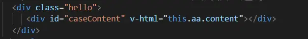
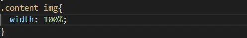
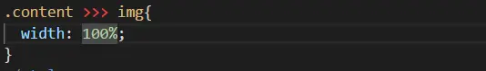
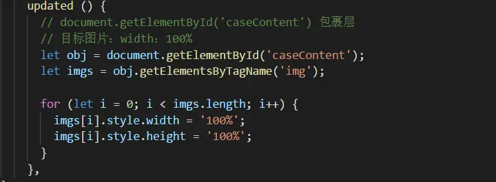

在vue2.0中使用v-html渲染时有可能我门会需要微调一下样式,今天在使用v-html时候发现一个问题，渲染出来的在&lt;style&gt;&lt;/style&gt;中无法直接改变样式。

&nbsp;

tp.png

当我们使用v-html渲染页面，使用下面这种方式去修改样式并没有效果，

&nbsp;

tp2.png

我在网上找了好多解决的方法 

&nbsp;

一.

&nbsp;

微信截图_20190330140624.png

 
我们可以 给 width：100% !important; 这样就可以改变 它的属性 

二. 
去掉style标签中的scoped属性 
scoped属性导致css仅对当前组件生效（用css3的属性选择器+生成的随机属性实现的），而html绑定渲染出的内容可以理解为是子组件的内容，子组件不会被加上对应的属性，所以不会应用css. 
但是我使用这种方法也并没有生效 
三. 
这种方法使我使用的试了下它可以生效 
在updated生命周期函数中，js动态配置样式，代码如下：

 

&nbsp;

微信截图_20190330140805.png

如果大家在使用前2个方法没有生效时,可以试一下第三中方法。

  作者：去看一场黑白电影 链接：https://www.jianshu.com/p/c8758c16fcf4 来源：简书
