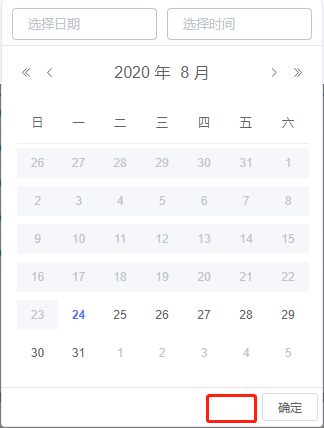

<pre>        &lt;el-date-picker class="dataPick" v-model="applyValue" 
type="datetime" :popper-class="'currentDatePickerClass'"
 value-format="yyyy-MM-dd HH:mm"
 format="yyyy-MM-dd HH:mm" placeholder="选择日期时间"
 :picker-options="{ disabledDate: (time) =&gt; { 
return dataTime.startTimeData(time) }, selectableRange: 
this.startTimeRange,}"&gt; &lt;/el-date-picker&gt;</pre>

<pre>&lt;style&gt;
.currentDatePickerClass &gt; .el-picker-panel__footer &gt; .el-button--text:first-child{
  display: none;
}
&lt;/style&gt;</pre>

&nbsp;
