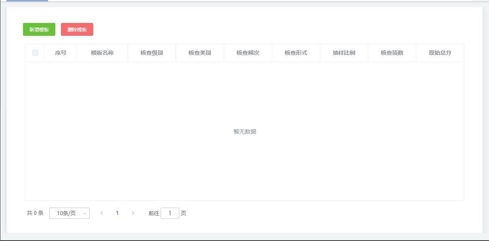
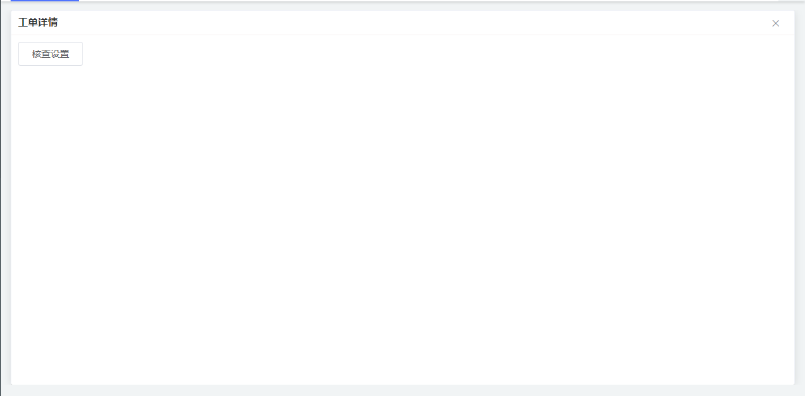

<h2>效果图</h2>
<h2></h2>

&nbsp;

&nbsp;

<pre>&lt;el-dialog
      title="工单详情"
      :visible.sync="dialogVisible"
      :fullscreen="true"
      :modal="false"
      width="30%"
      :before-close="handleClose"
    &gt;
      &lt;checkDetail&gt;&lt;/checkDetail&gt;
    &lt;/el-dialog&gt;

// 详情弹出层样式
/deep/.el-dialog__wrapper {
    margin: 1px 16px 0;
    position: absolute;
    z-index: 1 !important;
  /deep/.el-dialog__header {
    padding: 10px;
    border-bottom: 1px solid #f7f4f4;
    /deep/.el-dialog__title {
      line-height: 10px;
      color: #303133;
      font-size: 15px;
      font-weight: 800;
    }
  }
  /deep/.el-dialog__body {
    padding: 10px;
    height: calc(100% - 37px);
  }
  /deep/.el-dialog__headerbtn {
    top: 10px;
  }
}</pre>

&nbsp;
