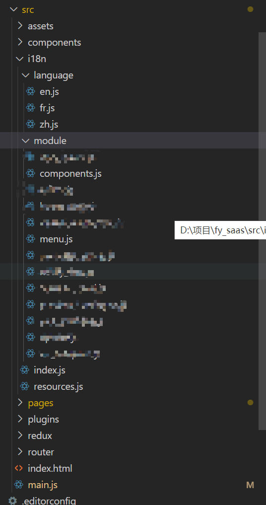

<h2>文件目录</h2>

&nbsp;

&nbsp;

<h2>index.js</h2>

<pre>import i18n from "i18next";
import { initReactI18next } from "react-i18next";

import LanguageDetector from "i18next-browser-languagedetector";
import resources from "./resources";
const langType = sessionStorage.getItem("langType");
i18n
  .use(LanguageDetector) //嗅探当前浏览器语言 zh-CN
  .use(initReactI18next)
  .init({
    resources,
    interpolation: {
      escapeValue: false,
    },
    lng: langType,
    debug: false,
    // fallbackLng: "zh", //默认当前环境的语言
    fallbackLng: ["en", "fr", "zh", "dev"],
    detection: {
      lookupSessionStorage: "langType",
      caches: ["sessionStorage"],
      order: ["sessionStorage"],
      lookupQuerystring: "lng",
    },
  });

export default i18n;</pre>

<h2>resources.js</h2>

<pre>/**
 * 加载语言文件 配置
 *
 *  zh   中文
 *  en   英文
 */
export default {
  en: require("./language/en.js").default,
  fr: require("./language/fr.js").default,
  zh: require("./language/zh.js").default,
};</pre>

<h2>language(en.js,zh.js,fr.js)</h2>

<pre>/**
 * 英文
 */
const language = "en";
export default {
  translation: {
    // 公共组件
    components: require("../module/components.js").default[language],
    // 菜单
    menu: require("../module/menu.js").default[language]
  },
};</pre>

<h2>module(components.js,menu.js)</h2>

<pre>export default {
  en: {
    with: "common",
    strip_data: "piece of data",
  },
  zh: {
    with: "共",
    strip_data: "条数据",  },
  fr: {
    with: "commun",
    strip_data: " donn&eacute;es",
  },
};</pre>

<h2>main.js</h2>

<pre>import React, { Suspense, useCallback, useEffect, useState } from "react";
import { ConfigProvider } from "antd";
import { render } from "react-dom";
import { Provider } from "react-redux";
import store from "./redux";
import { BrowserRouter, Switch, Route, Redirect } from "react-router-dom";
import zh from "antd/lib/locale/zh_CN";
import en from "antd/lib/locale/en_US";
import fr from "antd/lib/locale/fr_FR";
import PageLoad from "components/page_load";
import moment from "moment";
import "moment/locale/zh-cn";
import "moment/locale/en-nz";
import "moment/locale/fr";
import "assets/style/style.less";
import Layout from "pages/layout/index";
import "./i18n/index";
import i18n from "@/i18n/index";
import axios from "@/plugins/axios";
moment.locale("zh-cn");
const originalSetItem = sessionStorage.setItem;
sessionStorage.setItem = function (key, newValue) {
  const setItemEvent = new Event("setItemEvent");
  setItemEvent[key] = newValue;
  window.dispatchEvent(setItemEvent);
  originalSetItem.apply(this, [key, newValue]);
};
const App = () =&gt; {
  const [locale, setLocale] = useState(sessionStorage.getItem("langType"));
  const [loading, setLoading] = useState(true); //当token接口数据获取到后再进行路由渲染
  const REDIRECT_URL = "https://";
  const getPageQueries = (path) =&gt; {
    const query = {};
    path = path || window.location.href;
    const urlObj = new URL(path);
    const { search } = urlObj;

    if (search) {
      const arr = search.replace(/\\#\/.*\?/, "").split("&amp;");
      arr.forEach((item) =&gt; {
        const [key, value] = item.replace("?", "").split("=");
        query[key] = value;
      });
    }
    return query;
  };
  /* ======== 获取token ======== */
  const getToken = useCallback(async (authCode) =&gt; {
    setLoading(true);
    let res = await axios.post(
      "/getToken",
      { authCode },
      {
        baseURL: "/not-login/console/v1",
      }
    );
    if (!res) return false;
    sessionStorage.setItem("token", res.data?.token || "");
    setLoading(false);
    userInformation();
  }, []);
  /*========= 获取用户信息 =========*/
  const userInformation = async () =&gt; {
    let res = await axios.post("/get", {});
    if (!res) return false;
    sessionStorage.setItem("userInfo", JSON.stringify(res.data));
  };
  /* ======== 设置localStorge监听语言是否变化 ======== */
  useEffect(() =&gt; {
    const getLangType = (e) =&gt; {
      e?.langType &amp;&amp; setLocale(e.langType);
    };
    window.addEventListener("setItemEvent", getLangType);
    return () =&gt; {
      window.removeEventListener("setItemEvent", getLangType);
    };
  }, []);
  /* ======== 获取路由里面的authCode和lan ======== */
  useEffect(() =&gt; {
    let token = sessionStorage.getItem("token");
    let obj = getPageQueries(window.location);
    i18n.changeLanguage(obj.lan);
    if (obj?.authCode) {
      // sessionStorage.setItem("authCode", obj.authCode);
      getToken(obj?.authCode);
    } else if (token) {
      setLoading(false);
    }
  }, [getToken]);
  return (
    &lt;ConfigProvider locale={locale === "zh" ? zh : locale === "fr" ? fr : en}&gt;
      &lt;Provider store={store}&gt;
        &lt;Suspense fallback={&lt;PageLoad /&gt;}&gt;
          {!loading ? (
            &lt;BrowserRouter basename="/"&gt;
              &lt;Switch&gt;
                {/* &lt;Layout /&gt; */}
                &lt;Route
                  path="/"
                  render={({ location }) =&gt; {
                    let token = sessionStorage.getItem("token");
                    return token ? (
                      &lt;Layout /&gt;
                    ) : (
                      &lt;Route
                        component={() =&gt; {
                          window.location.href = `${REDIRECT_URL}`;
                          return null;
                        }}
                      /&gt;
                    );
                  }}
                /&gt;
              &lt;/Switch&gt;
            &lt;/BrowserRouter&gt;
          ) : (
            &lt;PageLoad /&gt;
          )}
        &lt;/Suspense&gt;
      &lt;/Provider&gt;
    &lt;/ConfigProvider&gt;
  );
};

render(&lt;App /&gt;, document.getElementById("app"));</pre>

<h2>调用示例</h2>

<pre>import { useTranslation } from "react-i18next";
export default () =&gt; {
  const { t } = useTranslation();
  return{
        &lt;p&gt;{t("components.with")}&lt;/p&gt;
  }
}

import i18next from "i18next";
export const getMaketTypeName = (val) =&gt; {
  switch (val) {
    case "12":
      return i18next.t("components.with");
    default:
      return "";
  }
};</pre>

<h2>修改语言</h2>

<pre>import React, { useContext, useMemo, useState, useEffect } from "react";

import { useTranslation } from "react-i18next";
import i18n from "@/i18n/index";
export default () =&gt; {
  const { t } = useTranslation();
  const [language, setLanguage] = useState("zh");

  const changeLanguage = (value) =&gt; {
    setLanguage(value);
    i18n.changeLanguage(value);
  };
  useEffect(() =&gt; {
    let type = sessionStorage.getItem("langType");
    if (type) {
      setLanguage(type);
    } else {
      //如果被清空了 那么当前语言会被设置为默认语言 zh
    }
  }, []);
  return (
              &lt;Select value={language} onChange={(value) =&gt; changeLanguage(value)} style={{ width: 100 }}&gt;
                &lt;Select.Option value="zh"&gt;中文&lt;/Select.Option&gt;
                &lt;Select.Option value="en"&gt;English&lt;/Select.Option&gt;
                &lt;Select.Option value="fr"&gt;Fran&ccedil;ais&lt;/Select.Option&gt;
              &lt;/Select&gt;
  );
};</pre>

&nbsp;
