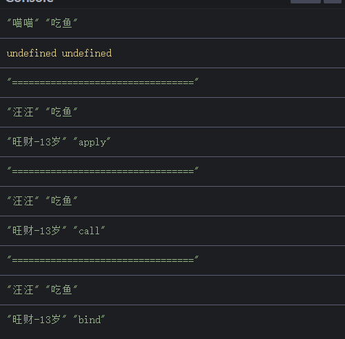

<h1>1.this的指向（this 永远指向最后调用它的那个对象）</h1>

<pre>var name = "windowsName";
function a() {
 var name = "Cherry";
 console.log(this.name);   // windowsName
 console.log("inner:" + this); // inner: Window
}
a();
console.log("outer:" + this)   // outer: Window

var name = "windowsName";
 var a = {
  name: "Cherry",
  fn : function () {
   console.log(this.name);  // Cherry
  }
 }
 a.fn();

//f 并没有调用，所以 fn() 最后仍然是被 window 调用的。所以 this 指向的也就是 window。
var name = "windowsName";
var a = {
 name : null,
 // name: "Cherry",
 fn : function () {
  console.log(this.name);  // windowsName
 }
}
var f = a.fn;
f();

var name = "windowsName";
var a = {
 name : null,
 // name: "Cherry",
 fn : function () {
  console.log(this.name);  // null
 }
}
var f = a.fn();
f;</pre>

<h1>2.改变this指向</h1>

<pre>var name = "windowsName";
 var a = {
  name : "Cherry",
  func1: function () {
   console.log(this.name)  
  },
  func2: function () {
   setTimeout( function () {
    this.func1()
   },100);
  }
 };
 a.func2()  //报错 this.func1 is not a function</pre>

<h2>（1）使用箭头函数</h2>

　　箭头函数中没有 this 绑定，必须通过查找作用域链来决定其值，如果箭头函数被非箭头函数包含，则 this 绑定的是最近一层非箭头函数的 this，否则，this 为 undefined

<pre>var name = "windowsName";
var a = {
 name : "Cherry",
 func1: function () {
  console.log(this.name)  
 },
 func2: function () {
  setTimeout( () =&gt; {
   this.func1() //this为a
  },100);
 }
};
a.func2()  // Cherry</pre>

<h2>（2）在函数内部使用 _this = this</h2>

　　在 func2 中，首先设置 var _this = this;，这里的 this 是调用 func2 的对象 a，为了防止在 func2 中的 setTimeout 被 window 调用而导致的在 setTimeout 中的 this 为 window。我们将 this(指向变量 a) 赋值给一个变量 _this，这样，在 func2 中我们使用 _this 就是指向对象 a 了。

<pre>var name = "windowsName";
var a = {
 name : "Cherry",
 func1: function () {
  console.log(this.name)  
 },
 func2: function () {
  var _this = this;
  setTimeout( function() {
   _this.func1()
  },100);
 }
};
a.func2()  // Cherry</pre>

<h1>3.call，apply，bind使用</h1>

<pre>var cat = {
  name: "喵喵",
  eatFish: function (param1, param2) {
    console.log(this.name, "吃鱼");
    console.log(param1, param2);
  }
};

var dog = {
  name: "汪汪",
  eatBone: function (param1, param2) {
    console.log(this.name, "啃骨头");
    console.log(param1, param2);
  }
};
cat.eatFish();
console.log("=================================");
cat.eatFish.apply(dog, ["旺财-13岁", "apply"]);
console.log("=================================");
cat.eatFish.call(dog, "旺财-13岁", "call");
console.log("=================================");
cat.eatFish.bind(dog, "旺财-13岁", "bind")();</pre>

&nbsp;参考（https://www.jb51.net/article/124024.htm）
