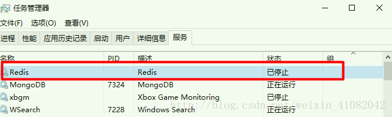
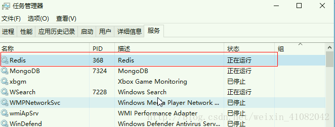

解压：redis-server.exe 启动服务&nbsp;redis-cli.exe 查询客户端

<strong>加入windows服务</strong>

1、解压到指定目录

2、首先将cmd指定到解压后的目录文件夹下,输入命令：

redis-server.exe&nbsp;--service-install&nbsp;redis.windows.conf&nbsp;--loglevel&nbsp;verbose&nbsp;

即可安装到Windows服务，

再输入redis-server --service-start启动服务

如果想要卸载服务，在cmd命令窗口中输入：&nbsp;redis-server&nbsp;--service-uninstall

&nbsp;
