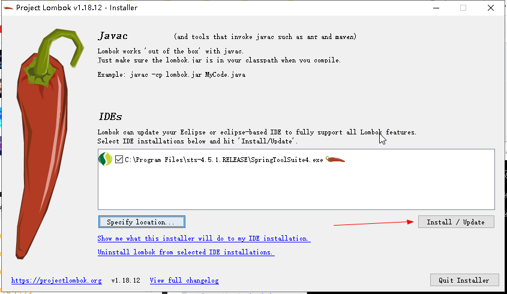
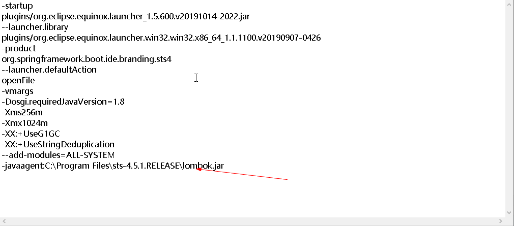

官网下载地址：<a href="https://projectlombok.org/download">https://projectlombok.org/download</a>

切到lombok下载的目录，运行命令：&nbsp;java -jar lombok.jar 之后找到你的STS安装目录选择安装即可

&nbsp;

&nbsp;

&nbsp;验证是否安装成功

&nbsp;
