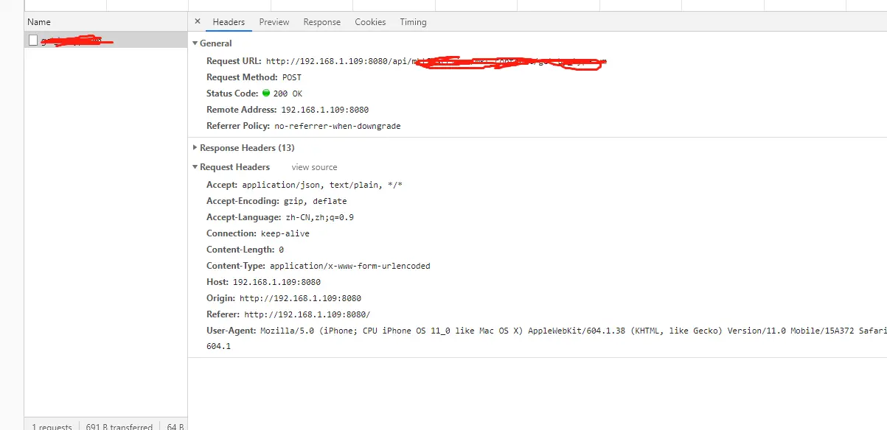

<h1>老规矩，先上代码</h1>

<pre>// 在根目录下自行创建vue.config.js
module.exports = {
  // cli3 代理是从指定的target后面开始匹配的，不是任意位置；配置pathRewrite可以做替换
  devServer: {
    port: '8080',
    open: true,
    proxy: {
      '/api': {
        // /api 的意义在于，声明axios中url已/api开头的请求都适用于该规则，
        // 注意是以/api开头，即：axios.post({url: '/api/xxx/xxx'})
        target: '服务器真实地址',
        // 此处target的意义在于：造成跨域是因为访
        // 问的host与我们的请求头里的origin不一致，所以我们要设置成一致，这个具体请看下文
        changeOrigin: true,
        pathRewrite: {'^/api': 'https://我是服务器/api'}
        // 此处是大部分文章都不会明说的的地方，
        // 既然我们设置了代理，则所有请求url都已写成/api/xxx/xxx，那请求如何知道我们到底请求的是哪个服务器的数据呢
        // 因此这里的意义在于， 以 /api开头的url请求，代理都会知道实际上应该请求那里，
        // &lsquo;我是服务器/api&rsquo;，后面的/api根据实际请求地址决定，即我的请求url：/api/test/test，被代理后请求的则是
        // https://我是服务器/api/test/test
      }
    }
  }
}</pre>

&nbsp;

<h2>一个已经代理成功的请求</h2>

 

如图，可以看到Request URL中的host 和  请求头中的 origin已经一致了，这就是为什么配置代理可以解决跨域的问题， 
造成跨域是因为request url的host与我们的origin不一致，也就是常说的，非同源，通过配置代理，我的请求变成了从 
192.168.1.109:8080(这是我本地的ip,解释一下)向192.168.1.109:8080请求数据，则解决了非同源的问题，

<h2>人话模式</h2>

人话：代理服务器代替我们请求了服务器的数据返回给了我本机，我本机向我本机请求代理替我拿到的数据，因此我不再需要考虑跨域了

<h2>就这样</h2>

  作者：_如图所示 链接：https://www.jianshu.com/p/f002ae1c046f 来源：简书 著作权归作者所有。商业转载请联系作者获得授权，非商业转载请注明出处。

&nbsp;

<pre>module.exports = {
  devServer: {
    proxy: {
      '/api': {
        target: 'http://localhost:8001', //目标地址--api路径
        ws: true, //// 是否启用websockets
        changeOrigin: true, //开启代理：在本地会创建一个虚拟服务端，然后发送请求的数据，并同时接收请求的数据，这样服务端和服务端进行数据的交互就不会有跨域问题
        pathRewrite: { '^/api': 'http://localhost:8080/api' } //这里重写路径--vue端口
      }
    }
  }
}</pre>

