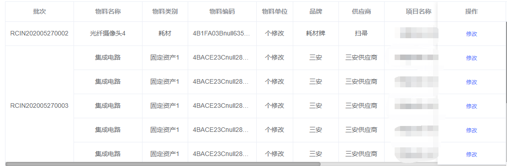

<strong>效果图</strong>

<h2>代码</h2>

<pre class="brush:html;gutter:true;">&lt;el-table
      :data="tableData"
      :span-method="objectSpanMethod"
      border
      style="width: 100%;"
      height="53vh"
      v-loading="dataListLoading"
    &gt;
</pre>

　　

<pre>this.getSpanArr(this.tableData);//后台获取到数据后进行数据处理

getSpanArr(data) {</pre>

&nbsp;&nbsp;&nbsp;&nbsp;&nbsp;&nbsp;this.spanArr=[]

<pre>for (var i = 0; i &lt; data.length; i++) {
        if (i === 0) {
          this.spanArr.push(1);
          this.pos = 0
        } else {
          // 判断当前元素与上一个元素是否相同  inAccessCode（批次字段）
          if (data[i].inAccessCode === data[i - 1].inAccessCode) {
            this.spanArr[this.pos] += 1;
            this.spanArr.push(0);
          } else {
            this.spanArr.push(1);
            this.pos = i;
          }
        }
      }
    },
//进行表格合并
objectSpanMethod({ row, column, rowIndex, columnIndex }) {
      if (columnIndex === 0) {
        const _row = this.spanArr[rowIndex];
        const _col = _row &gt; 0 ? 1 : 0;
        return {
          rowspan: _row,
          colspan: _col
        }
      }
    },</pre>

<h2>原理</h2>

getSpanArr(data)方法 data就是我们从后台拿到的数据，通常是一个数组；spanArr是一个空的数组，用于存放每一行记录的合并数；pos是spanArr的索引。

如果是第一条记录（索引为０），向数组中加入１，并设置索引位置；如果不是第一条记录，则判断它与前一条记录是否相等，如果相等，则向spanArr中添入元素０，并将前一位元素＋１，表示合并行数＋１，

以此往复，得到所有行的合并数，０即表示该行不显示

<strong>[0,0] 表示这一行不显示， [2,1]表示行的合并数（该原理引用https://www.cnblogs.com/mmzuo-798/p/11686021.html ）</strong>
