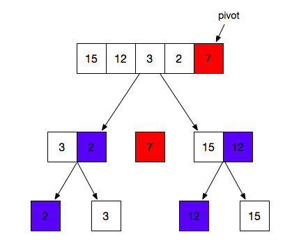

<h2>1.vue数据双向绑定原理（<a href="https://links.jianshu.com/go?to=https%3A%2F%2Fmy.oschina.net%2Fu%2F4386652%2Fblog%2F4281447" target="_blank">https://my.oschina.net/u/4386652/blog/4281447</a>）</h2>

通过数据劫持结合发布者-订阅者模式进行双向数据绑定的

数据劫持就是通过Object.defineProperty(obj,key,val) 劫持各个属性的getter,setter属性，进而获取属性值并进行监听

Observer 观察者&nbsp; 递归的监听对象上的每一个属性，当属性值发生改变时，会触发相应的watcher

Watcher&nbsp; 发布者&nbsp; 当监听的数据值发生修改时，执行相应的回调函数

Dep&nbsp; 订阅管理器&nbsp; 连接观察者和发布者的桥梁，每一个Observer对应一个dep，它内部维护一个数组，存储与该Observer相关的Watcher

Object.defineProperty()中可以设置get和set方法

get 是给属性提供getter的方法，获取属性值，需要有返回值，该方法返回值被用作属性值，读取属性值时会调用该函数

set 是给属性提供setter的方法，设置属性值，不需要返回值，设置属性值时会调用该函数

<strong>数据变化更新视图 view =&gt; model 利用Object.defineProperty的get、set函数对数据更改、读取进行监听。如果数据改变就通知watcher进行重新渲染页面</strong> <strong>视图变化更新数据 model =&gt; view 利用事件监听，通过target.value拿到新值赋值给data</strong>

<h2><strong>2.快速排序的思想（<a href="https://segmentfault.com/a/1190000017814119" target="_blank">https://segmentfault.com/a/1190000017814119</a>）</strong></h2>

<strong></strong>

&nbsp;

<ol>
<li>选择左右边的元素为基准数，7</li>
<li>将小于7的放在左边，大于7的放在右边，然后将基准数放到中间</li>
<li>然后再重复操作从左边的数组选择一个基准点2</li>
<li>3比2大则放到基准树的右边</li>
<li>右边的数组也是一样选择12作为基准数，15比12大所以放到了12的右边</li>
<li>最后出来的结果就是从左到右 2 ，3，7，12，15了 

<pre>var quickSort = function(arr) {
  if (arr.length &lt;= 1) {
    return arr;
  }
  var pivotIndex = Math.floor(arr.length / 2);
  var pivot = arr.splice(pivotIndex, 1)[0];
  var left = [];
  var right = [];

  for (var i = 0; i &lt; arr.length; i++) {
    if (arr[i] &lt; pivot) {
      left.push(arr[i]);
    } else {
      right.push(arr[i]);
    }
  }
  return quickSort(left).concat([pivot], quickSort(right));
};</pre>

View Code

&nbsp;

</li>
</ol>
<h2 id="tcp传输控制协议和udp用户数据报协议区别">3.TCP(传输控制协议)和UDP（用户数据报协议）区别(<a href="https://blog.csdn.net/weixin_39123191/article/details/81381998" target="_blank">https://blog.csdn.net/weixin_39123191/article/details/81381998</a>)</h2>
<ul>
<li>TCP是一种面向连接的、可靠的、基于字节流的传输层通信协议，是专门为了在不可靠的网络中提供一个可靠的端对端字节流而设计的，面向字节流。</li>
<li>UDP（用户数据报协议）是iso参考模型中一种无连接的传输层协议，提供简单不可靠的非连接传输层服务，面向报文</li>
</ul>

&nbsp;

<ul>
<li>1） TCP是面向连接的，可靠性高；UDP是基于非连接的，可靠性低</li>
<li>2） 由于TCP是连接的通信，需要有三次握手、重新确认等连接过程，会有延时，实时性差，同时过程复杂，也使其易于攻击；UDP没有建立连接的过程，因而实时性较强，也稍安全</li>
<li>3） 在传输相同大小的数据时，TCP首部开销20字节；UDP首部开销8字节，TCP报头比UDP复杂，故实际包含的用户数据较少。TCP在IP协议的基础上添加了序号机制、确认机制、超时重传机制等，保证了传输的可靠性，不会出现丢包或乱序，而UDP有丢包，故TCP开销大，UDP开销较小</li>
<li>4） 每条TCP连接只能时点到点的；UDP支持一对一、一对多、多对一、多对多的交互通信</li>
</ul>
<h2>4.撤回git的代码</h2>
<h2>（<a href="https://juejin.cn/post/6932026894015856654" target="_blank">https://juejin.cn/post/6932026894015856654</a>&nbsp; &nbsp; &nbsp;&nbsp;<a href="https://juejin.cn/post/6844904038631374855" target="_blank">https://juejin.cn/post/6844904038631374855</a>）</h2>
<h2>5.Vue生命周期</h2>
<h2>6.Vuex（<a href="https://juejin.cn/post/6844903937745616910" target="_blank">https://juejin.cn/post/6844903937745616910</a>）</h2>
<h2>7.css伪类（<a href="https://www.runoob.com/css/css-pseudo-classes.html" target="_blank">https://www.runoob.com/css/css-pseudo-classes.html</a>）</h2>
<h2>8.重绘和回流（<a href="https://www.jianshu.com/p/e081f9aa03fb" target="_blank">https://www.jianshu.com/p/e081f9aa03fb</a>）</h2>

