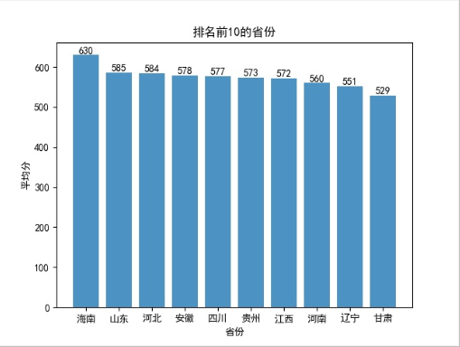
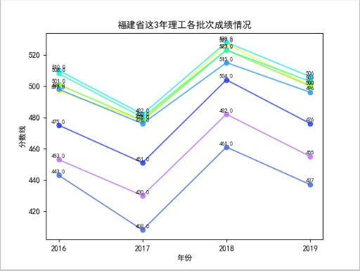
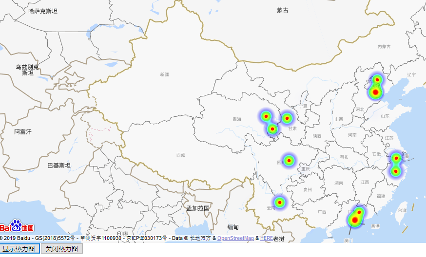
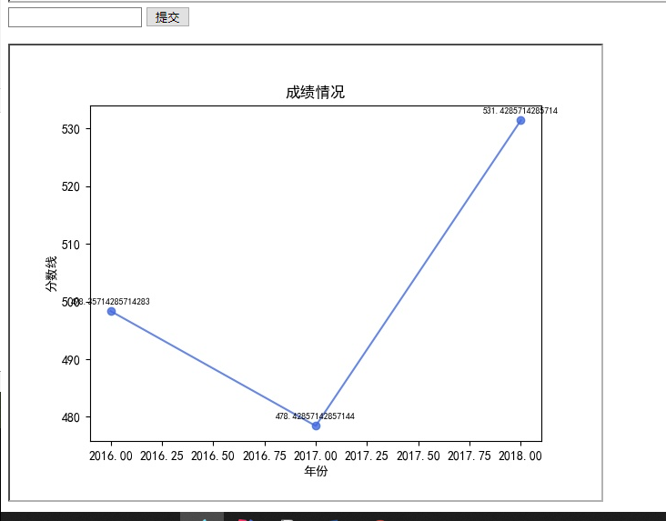
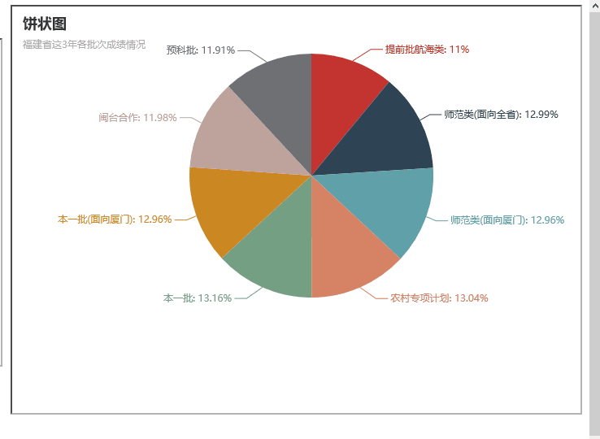

分析文件&lsquo;集美大学各省录取分数.xlsx&rsquo;，完成以下功能：

1）集美大学2015-2018年间不同省份在本一批的平均分数，柱状图展示排名前10的省份，

2）分析福建省这3年各批次成绩情况，使用折线图展示结果，并预测2019年录取成绩

3）分析其他省份数据。用热力图，地图方式绘制所有省份数据情况。

4）根据输入省份动态显示省份分数线的分析图

<h5>导入相应的库</h5>

<pre>import xlrd
import matplotlib.pyplot as plt
import numpy as np
from urllib.request import urlopen, quote
import requests,csv
import pandas as pd #导入这些库后边都要用到
from pyecharts import Line,Bar,Pie,Radar
import json
from werkzeug.utils import redirect
from flask import Flask, jsonify, render_template, request, url_for</pre>

&nbsp;

<h2>python读取excel文件数据</h2>

<pre>import xlrd
excel_path="..\\grade.xlsx"
#打开文件，获取excel文件的workbook（工作簿）对象
excel=xlrd.open_workbook(excel_path,encoding_override="utf-8")
# 返回所有Sheet对象的list
all_sheet=excel.sheets()
#循环遍历每个sheet对象存储表中所有数据
grade_list=[]
# 将文件中数据存进grade_list
for sheet in all_sheet:
    for each_row in range(sheet.nrows):#循环打印每一行
        grade_list.append(sheet.row_values(each_row))</pre>

<h2>python移除列表空数据</h2>

<pre>    def removeNull(alist):
        for i in alist:
            if i == '':
                alist.remove(i)
        return alist</pre>

<h2>python图表中文乱码</h2>

<pre>#设置中文乱码
from pylab import *
mpl.rcParams['font.sans-serif'] = ['SimHei']</pre>

<h2>python列表内所有数据相加求平均数</h2>

<pre>    # 列表数据相加求平均
    def sum_list(items):
        sum_numbers = 0
        count = 0
        for x in items:
            sum_numbers += x
            count += 1
        return int(sum_numbers / count)</pre>

<h2>python将字典前十key、value存入列表</h2>

<pre>    #字典的前十key values
    def topTenKey(dict_order):
        count = 0
        order=[]
        for key in dict_order.keys():
            count+=1
            if count&gt;10:
                break
            else:
                order.append(key)
        return order
    def topTenValue(dict_order):
        count = 0
        order=[]
        for key in dict_order.values():
            count+=1
            if count&gt;10:
                break
            else:
                order.append(key)
        return order</pre>

<h2>python 移除列表第一个元素 和最后一个元素</h2>

<pre>grade_list.pop(0)
grade_list.pop()</pre>

<h2>flask框架使用，并从前端页面获取数据，后台处理返回页面</h2>

<pre>from flask import Flask, jsonify, render_template, request, url_for

app = Flask(__name__)

def main():
        @app.route("/index")
    def index():
        return render_template("Base.html")

        @app.route('/test',methods=['POST'])
    def testGet():
        year = request.form.get('year')
        tenYear(province_dict,int(year))
        print("执行get")
        return render_template("Base.html")

if __name__ == '__main__':
    main()
    app.run(host='127.0.0.1', port=8080, debug=True)</pre>

<pre>&lt;!DOCTYPE html&gt;
&lt;html lang="en"&gt;
&lt;head&gt;
    &lt;meta charset="UTF-8"&gt;
    &lt;title&gt;集美大学录取分数&lt;/title&gt;
&lt;/head&gt;
&lt;body&gt;
    &lt;div style="display: flex"&gt;
        &lt;div&gt;
            &lt;form action="/test" method="post"&gt;
                &lt;input type="text" name="year" &gt;
                &lt;input type="submit" value="提交" onclick="change(1)"&gt;
            &lt;/form&gt;
            &lt;br&gt;
            &lt;iframe src="http://127.0.0.1:8080/ten"
                    width="850px" height="400px"   frameborder="1/0"
                    name="" id="iframe-b" scrolling="no"&gt;&lt;/iframe&gt;
        &lt;/div&gt;

&lt;/body&gt;
&lt;script&gt;

    function change(e) {
        if(e==1){
            document.getElementById('iframe-b').contentWindow.location.reload();
        }

    }
&lt;/script&gt;
&lt;/html&gt;</pre>

&nbsp;

1、项目采用的技术栈

　　flask框架

&nbsp;&nbsp;&nbsp;&nbsp;&nbsp;&nbsp;&nbsp; Numpy：矩阵计算与其它大多数框架的数据处理基础；

&nbsp;&nbsp;&nbsp;&nbsp;&nbsp;&nbsp;&nbsp; Matplotlab：专业画图工具，话说这个单词还是真是在Matlab之间插入了plot这个词形成的；

&nbsp;&nbsp;&nbsp;&nbsp;&nbsp;&nbsp;&nbsp; Pandas：提供类似于R语言的DataFrame操作，非常方便；

&nbsp;&nbsp;&nbsp;&nbsp;&nbsp;&nbsp;&nbsp; 百度地图API

&nbsp;&nbsp;&nbsp;&nbsp;&nbsp;&nbsp;&nbsp; 热力图

　　pyecharts

2、系统模块列表

柱状图、折线图、热力图，饼状图，

3、柱状图：集美大学2015-2018年间不同省份在本一批的平均分数，展示排名前10的省份。

&nbsp;

<pre>#绘图
plt.figure()
plt.bar(x=province_dict_keys,height=province_dict_values,alpha=0.8)
for x,y in enumerate(province_dict_values):
    plt.text(x, y, '%s' % y, ha='center', va='bottom')
#设置标题
plt.title("排名前10的省份")
# 为两条坐标轴设置名称
plt.xlabel("省份")
plt.ylabel("平均分")
#图片的显示及存储
log = datetime.datetime.now().strftime('%Y-%m-%d')
# plt.savefig('./logging/%s_all_a.jpg' % log)   #图片的存储
# plt.close()   #关闭matplotlib </pre>

<pre>bar = Bar("柱状图", "%s本一批的平均分数"%year)
bar.add("平均录取分数", province_dict_keys, province_dict_values, mark_line=["average"], mark_point=["max", "min"])
# 生成本地文件（默认为.html文件）
bar.render('./templates/ten.html')</pre>

&nbsp;

4、折线图：分析福建省这3年各批次成绩情况，使用折线图展示结果，并预测2019年录取成绩

<pre>#折线图

plt.figure()

plt.plot(grade_year,grade,'ro-', color='#4169E1', alpha=0.8, label='提前批航海类（理工）')

plt.plot(grade_year,grade1,'ro-', color='#FFFA12', alpha=0.8, label='师范类(面向全省)（理工）')

plt.plot(grade_year,grade2,'ro-', color='#78FF1D', alpha=0.8, label='师范类(面向厦门)（理工）')

plt.plot(grade_year,grade3,'ro-', color='#1CFFB7', alpha=0.8, label='农村专项计划（理工）')

plt.plot(grade_year,grade4,'ro-', color='#1BE9FF', alpha=0.8, label='本一批（理工）')

plt.plot(grade_year,grade5,'ro-', color='#1F98FF', alpha=0.8, label='本一批(面向厦门)（理工）')

plt.plot(grade_year,grade6,'ro-', color='#2237FF', alpha=0.8, label='闽台合作（理工）')

plt.plot(grade_year,grade7,'ro-', color='#BA6BFF', alpha=0.8, label='预科批（理工）') #在当前绘图对象绘图（X轴，Y轴，蓝色虚线，线宽度）

for y in [grade,grade1,grade2,grade3,grade4,grade5,grade6,grade7]:

    for x,yy in zip(grade_year,y):

        plt.text(x, yy+1,str(yy), ha='center', va='bottom', fontsize=7)

plt.xlabel("年份") #X轴标签

plt.ylabel("分数线") #Y轴标签

plt.title("福建省这3年理工各批次成绩情况") #标题

# plt.savefig('./logging/%s_all_b.jpg' % log)   #图片的存储

#显示图示

plt.legend()

plt.show()</pre>

&nbsp;

<pre>line = Line("折线图","%s批次情况分析"%otherProvince)
line.add("", grade_batch, batch_grade, is_label_show=True)
line.render('./templates/otherProvince.html')</pre>

&nbsp;

5、热力图：分析其他省份数据。有精力同学可以研究热力图，地图方式绘制所有省份数据情况。

&nbsp; 

<pre>gr=batch('本一批','理工')

gr=sorted(gr.items(),key=lambda x:x[1],reverse=True)

file = open(r'../point.json','w') #建立json数据文件

point_pr(gr,file)

#获取经纬度

def getlnglat(address):
    url = 'http://api.map.baidu.com/geocoding/v3/'
    output = 'json'
    ak = '8atpMUyuexdbuYFU838ejPvSPnWYZoks'
    add = quote(address) #由于本文城市变量为中文，为防止乱码，先用quote进行编码
    uri = url + '?' + 'address=' + add  + '&amp;output=' + output + '&amp;ak=' + ak
    req = urlopen(uri)
    res = req.read().decode() #将其他编码的字符串解码成unicode
    temp = json.loads(res) #对json数据进行解析
    return temp
def point_pr(gr,file):
#每个省份的经纬度
    print(gr)
    for line in gr:
        # line是个list，取得所有需要的值
        b = line[0] #将第一列city读取出来并清除不需要字符
        if b == '西藏' or b == '':
            continue
        c= line[1]#将第二列price读取出来并清除不需要字符
        lng = getlnglat(b)['result']['location']['lng'] #采用构造的函数来获取经度
        lat = getlnglat(b)['result']['location']['lat'] #获取纬度
        str_temp = '{"lat":' + str(lat) + ',"lng":' + str(lng) + ',"count":' + str(c) +'},'
        # print(str_temp) #也可以通过打印出来，把数据copy到百度热力地图api的相应位置上
        file.write(str_temp) #写入文档
    file.close()</pre>

6、根据输入的省份分析录取分数情况：

<pre>def province_line(province):
        print(province)
        grade1_year=[2016,2017,2018]
        grade_priv=[]
        for e in grade1_year:
            count=0
            sum=0
            for grade_list_row in grade_list:
                if e ==grade_list_row[7] and province==grade_list_row[0]:
                    sum+=grade_list_row[6]
                    count+=1
            if count&gt;1:
                grade_priv.append(sum/count)
            else:
                grade_priv.append(sum)
        plt.figure()
        print(grade1_year,grade_priv)
        plt.plot(grade1_year,grade_priv,'ro-', color='#4169E1', alpha=0.8)
        for x,y in zip(grade1_year,grade_priv):
            plt.text(x, y+1,str(y), ha='center', va='bottom', fontsize=7)
        plt.xlabel("年份") #X轴标签
        plt.ylabel("分数线") #Y轴标签
        plt.title("成绩情况") #标题
        plt.savefig('./static/logging/2019-12-08_all_d.jpg')   #图片的存储</pre>

&nbsp;7、饼状图

<pre>    # //设置主标题与副标题，标题设置居中，设置宽度为900
    pie = Pie("饼状图", "福建省这3年各批次成绩情况",title_pos='top',width=900)
    # //加入数据，设置坐标位置为【25，50】，上方的colums选项取消显示
    pie.add("降水量", grade_batch, batch_grade ,center=[40,50],is_legend_show=False,is_label_show=True)
    # //保存图表
    pie.render('./templates/pie_batch.html')</pre>

8、雷达图

<pre>        radar = Radar("雷达图", "一年的降水量与蒸发量")
        schema =[('网络1611',100), ('网络1612',100), ('网络1613',100),
                 ('网络1711',100), ('网络1712',100), ('网络1714',100),
                 ( '网络1811',100), ('网络1814',100), ('网络1813',100)]
        # //传入坐标
        radar.config(schema)
        # //一般默认为同一种颜色，这里为了便于区分，需要设置item的颜色
        radar.add("蒸发量",score1,item_color="#1C86EE")
        radar.render('./templates/sex.html')</pre>

&nbsp;

码云地址：https://gitee.com/leaf28/university.git
