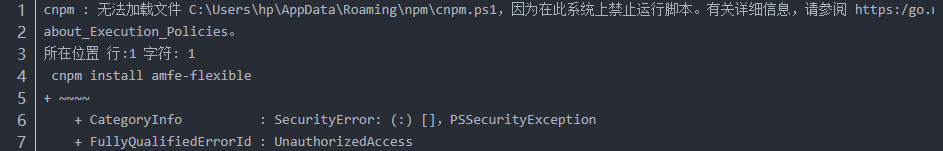
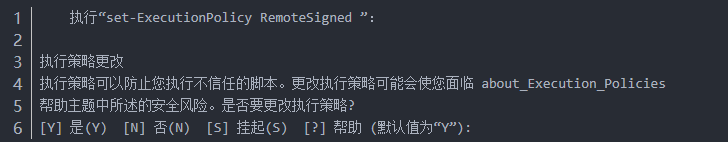

<h1 class="postTitle">转载自<a href="https://www.cnblogs.com/chenzhiran/p/12080349.html">https://www.cnblogs.com/chenzhiran/p/12080349.html</a></h1>

今天使用npm安装插件时出现了以下错误：

&nbsp;

经查，原因：现用执行策略是 Restricted（默认设置）

解决办法：

1.win+X键，使用管理员身份运行power shell

2.输入命令：set-executionpolicy remotesigned

&nbsp;

&nbsp;3.输入&rdquo;Y&ldquo;,回车，问题解决。

