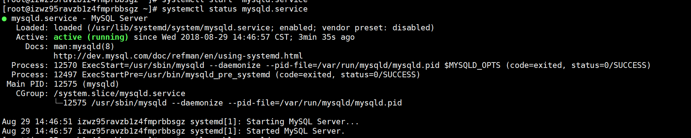
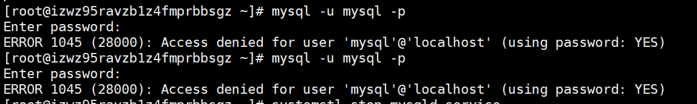
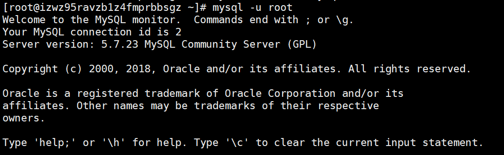
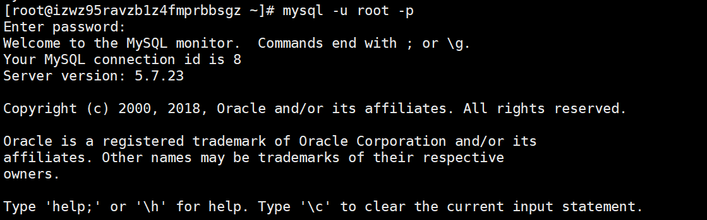
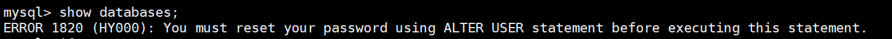
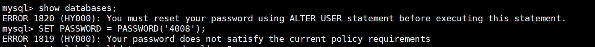
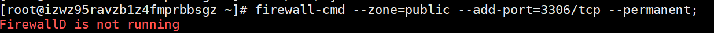
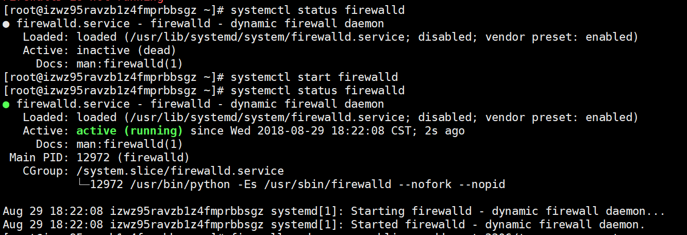
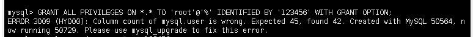
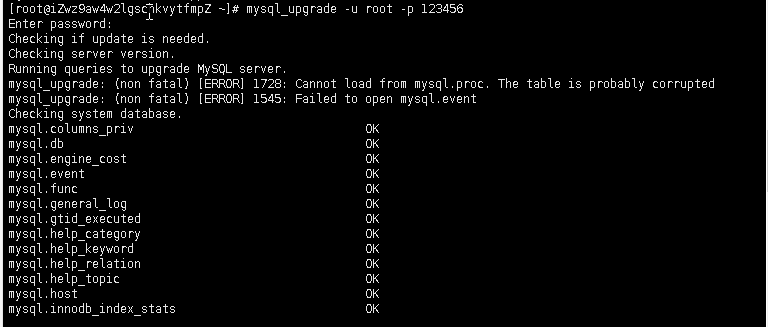

<strong>删除原来的数据库：</strong>

centos7中默认安装了数据库MariaDB，如果直接安装MySQL的话，会直接覆盖掉这个数据库，当然也可以手动删除一下：

&nbsp;

<pre>[root@localhost ~]# rpm -qa|grep mariadb  // 查询出来已安装的mariadb
[root@localhost ~]# rpm -e --nodeps 文件名  // 卸载mariadb，文件名为上述命令查询出来的文件</pre>

&nbsp;

然后现在开始将当前目录切换到root也就是：&nbsp; &nbsp; cd ~

&nbsp;

&nbsp;

<strong>下载与安装MySQL：</strong>

这里采用Yum管理好了各种rpm包的依赖，能够从指定的服务器自动下载RPM包并且安装，所以在安装完成后必须要卸掉，否则会自动更新。

1.安装MySQL官方的yum repository

<pre>[root@localhost ~]# wget -i -c http://dev.mysql.com/get/mysql57-community-release-el7-10.noarch.rpm</pre>

2.下载rpm包

<pre>[root@localhost ~]# yum -y install mysql57-community-release-el7-10.noarch.rpm</pre>

3.安装MySQL服务

<pre>[root@localhost ~]# yum -y install mysql-community-server</pre>

最后会出现个complete！

4.启动MySQL服务

<pre>[root@localhost ~]# systemctl start  mysqld.service</pre>

看到类似下面的界面，或者以Starting MySqL server..&nbsp; &nbsp;started MysqlServer..结尾的就成功启动了

&nbsp;

还有几个关于MySQL常用的命令：

<pre>重启：systemctl restart mysqld.service

停止：systemctl stop mysqld.service

查看状态：systemctl status mysqld.service</pre>

&nbsp;

还可以配置MySQL的开机启动：

<pre>[root@woitumi-128 ~]# systemctl enable mysqld

[root@woitumi-128 ~]# systemctl daemon-reload   刚刚配置的服务需要让systemctl能识别，就必须刷新配置</pre>

&nbsp;

&nbsp;

&nbsp;

<strong>&nbsp;关于登录MySQL：</strong>

<strong>登录命令：</strong>

<pre>[root@localhost ~]# mysql -u root -p</pre>

意思就是用root用户登录，然后准备输入密码。

第一次启动MySQL后，就会有临时密码，这个默认的初始密码在/var/log/mysqld.log文件中，我们可以用这个命令来查看：

<pre>grep "password" /var/log/mysqld.log</pre>

可是不知道是我输错密码还是不能复制粘贴，一直显示错误：

&nbsp;

（好吧后面看看这个代码应该是&nbsp; mysql -u root -p才对，可能这样输入命令就不会有错吧&hellip;&hellip;）

&nbsp;

<strong>然后我们还可以先跳过密码验证登录进MySQL：</strong>

停止服务：

<pre>systemctl stop mysqld.service</pre>

修改mMySQL的配置文件：

<pre>vi /etc/my.cnf</pre>

在最后加上配置：

<pre>skip-grant-tables</pre>

然后再启动服务：

<pre>systemctl start mysqld.service</pre>

&nbsp;

然后这时就可以跳过密码来登录mysql：

<pre>mysql -u root</pre>

&nbsp;

<strong>然后是修改下密码：</strong>（就看别人的例子是这样的）

<pre>mysql&gt; use mysql;
Database changed
mysql&gt; update mysql.user set authentication_string=password('4008') where user='root' ;
Query OK, 1 row affected, 1 warning (0.00 sec)
Rows matched: 1  Changed: 1  Warnings: 1</pre>

&nbsp;

然后exit退出mysql，重新在刚刚那个配置文件中去掉skip-grant-tables，然后重启MySQL。

&nbsp;

然后就可以用新密码登录了：

&nbsp;

<strong>sql报错</strong>

但这个时候，我试了一下一个简单的sql语句：

&nbsp;

what？？？我不是刚刚才设完密码吗？？

然后百度了下。说这个情况还要加个这样的改密码的语句：

<pre>SET PASSWORD = PASSWORD('密码');</pre>

但这个命令又出现了这样的问题：

额百度后知道原来是密码等级太简单，如果你坚持要这样的密码，<strong>要改变密码等级：</strong>

登录数据库后，输入

<pre>mysql&gt; set global validate_password_policy=0;  //改变密码等级

mysql&gt; set global validate_password_length=4;   //改变密码最小长度</pre>

然后再输入刚刚的命令：

<pre>SET PASSWORD = PASSWORD('密码');</pre>

然后再用 show databases;就没有报错了

&nbsp;

&nbsp;

<strong>配置远程登录：</strong>

MySQL默认root用户只能本地登录，如果要远程连接，要简单设置下，这里直接用root来远程登录不添加其他角色。

使用命令：

<pre>GRANT ALL PRIVILEGES ON *.* TO 'root'@'%' IDENTIFIED BY '4008' WITH GRANT OPTION;</pre>

.*.的意思是所有库的所有表；To后面跟的是用户名；@后面跟的是ip地址，%代表所有ip地址，identified by后面的是密码。

然后再：

<pre>mysql&gt; flush privileges;</pre>

&nbsp;

注意：

需要注意mysql的配置文件中的bindaddress 的参数和skip-networking 配置

bindaddress : 设定哪些ip地址被配置，使得mysql服务器只回应哪些ip地址的请求),最好注释掉该参数或设置成为127.0.0.1以外的值

skip-networking : 如果设置了该参数项，将导致所有TCP/IP端口没有被监听,也就是说出了本机，其他客户端都无法用网络连接到本mysql服务器，所以应该注释掉该参数

&nbsp;

&nbsp;

<strong>添加3306端口：</strong>

命令：

<pre>firewall-cmd --zone=public --add-port=3306/tcp --permanent;</pre>

&nbsp;

结果说没有运行防火墙：

&nbsp;

那就先开防火墙咯：

<pre>systemctl status firewalld  查看防火墙状态

systemctl start firewalld  打开防火墙</pre>

&nbsp;

&nbsp;

&nbsp;

然后再输入那个开放3306端口的命令就行了

<pre>firewall-cmd --zone=public --add-port=3306/tcp --permanent;

firewall-cmd --reload  重启防火墙</pre>

&nbsp;

&nbsp;

&nbsp;

&nbsp;

<strong>最后的收尾：</strong>

<strong>1.我们刚开始说要写在yum的repository，用这个命令就行：</strong>

<pre>yum -y remove mysql57-community-release-el7-10.noarch</pre>

&nbsp;

<strong>2.MySQL设一下utf8：</strong>

打开/etc/my.cnf也就是数据库的配置文件，然后在底部复制粘贴：

<pre>[mysqld] 

character_set_server=utf8
init_connect='SET NAMES utf8'</pre>

采用navicat新建数据库时，需要将编码方式设置为，字符集：utf8 -- UTF-8 Unicode ，排序规则：utf8_general_ci

<strong>3.阿里云的服务器中的安全组加入mysql连接的规则。这个很重要不然远程无法连接上。</strong>

<strong>4.配置文件的说明：</strong>

　　/etc/my.cnf 这是mysql的主配置文件 　　/var/lib/mysql mysql数据库的数据库文件存放位置 　　/var/log mysql数据库的日志输出存放位置

以上转载至<a href="https://www.cnblogs.com/wangshen31/p/9556804.html">https://www.cnblogs.com/wangshen31/p/9556804.html</a>

1、在本地数据库中先导出数据库的数据和结构

2、通过rz命令上传至云服务器(我上传在根目录下)

3、在数据库中创建数据库&nbsp;CREATE DATABASE `mydb` CHARACTER SET utf8 COLLATE utf8_general_ci;

4、导入sql文件&nbsp; 1切换数据库&nbsp;&nbsp;use qz;&nbsp; 2source qz.sql

show tables;查看数据库表

&nbsp;

在执行

<pre>GRANT ALL PRIVILEGES ON *.* TO 'root'@'%' IDENTIFIED BY '4008' WITH GRANT OPTION;出现错误 ERROR 3009 (HY000): Column count of mysql.user is wrong. Expected 45, found 42. Created with MySQL 50564, now running 50729. Please use mysql_upgrade to fix this error.</pre>

&nbsp;

&nbsp;

<h4 id="错误是由于你曾经升级过数据库升级完后没有使用">错误是由于你曾经升级过数据库，升级完后没有使用</h4>
<h4 id="mysqlupgrade升级数据结构造成的">mysql_upgrade升级数据结构造成的。</h4>

使用mysql_upgrade命令 root@localhost ~]# mysql_upgrade -u root -p 13456

&nbsp;
