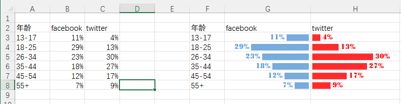

REPT函数听说过吧？就是按指定的次数重复指定的内容。比如公式:
``` =REPT(“❤”,5) ```

结果就是：❤❤❤❤❤

好玩吧？使用这个函数，可以将两列数据表格做成类似旋风图的效果：



这是习惯访问facebook和twitter的人群不同年龄段的统计数据。

单击G3单元格，设置字体为Stencil，字号为11，字体颜色为蓝色，设置对齐方式为右对齐。

在G3单元格输入公式，向下复制到G8单元格。

```=TEXT(B3,"0%")&" "&REPT("|",B3*200)```


使用TEXT函数将B3单元格的引用结果设置为百分比格式，再使用连接符&连接一个空格作为数字与条形之间的间隔，以此模拟图表数据标签。

REPT第二参数必须使用整数，由于B3单元格为百分比，所以使用B3*200得到一个较大的整数。

好了，左侧的效果已经出来了，右侧的效果也是类似的步骤：

单击H3单元格，设置字体为Stencil，字号为11，字体颜色为红色，设置对齐方式为左对齐。

在H3单元格输入公式，向下复制到H8单元格。

```=REPT("|",C3*200)&" "&TEXT(C3,"0%")```

公式原理与G3单元格公式原理相同，只是将TEXT函数的结果放到ERPT函数的右侧，模拟出了图表数据标签效果。

> 参考：https://www.excelhome.net/4804.html
